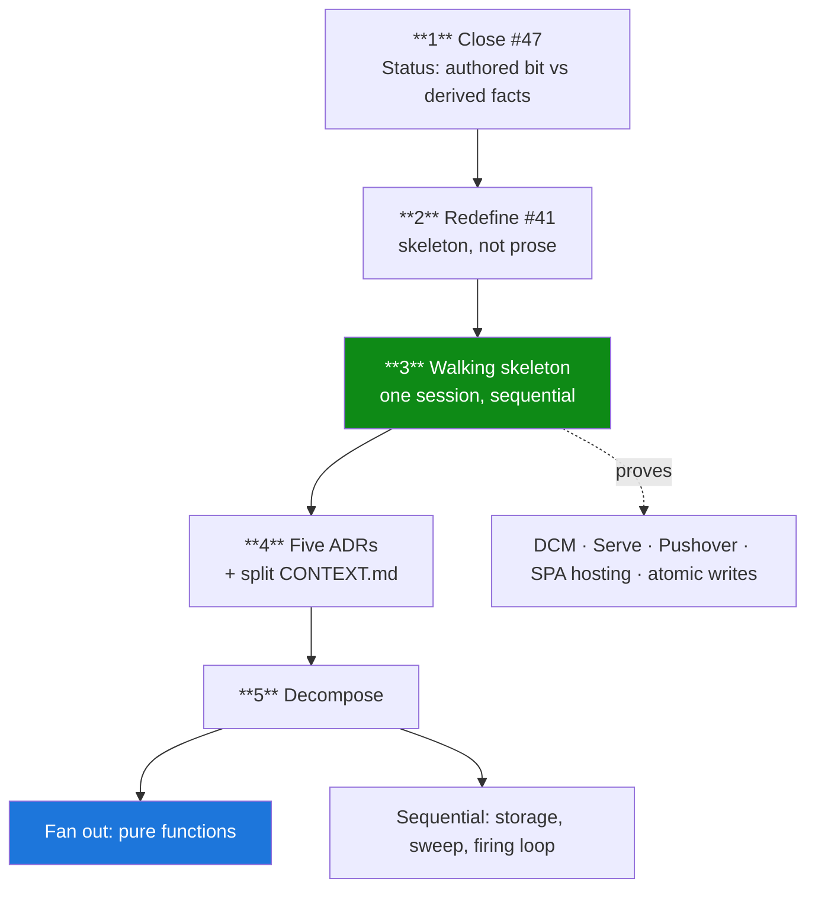

# Build plan — getting from a finished map to running code

**Status:** proposed 2026-08-26; steps 1 and 2 actioned the same day. Not a ticket and deliberately not ticket-shaped — it is the
ordering that the tickets sit inside. Individual doing-work still becomes GitHub issues as usual
(see `docs/agents/issue-tracker.md`); this file is what tells you which issues to write next.

## Where the project actually stands

The map (#1) is **finished**. Its `Not yet specified` section is empty — every fog patch graduated
in one pass — and `./scripts/frontier.sh` shows a two-row frontier: #47 takeable, #41 blocked by it.
`CONTEXT.md` is 1,882 lines of settled model. Five research tickets closed with device-verified
answers.

There is no code because **nothing in the process was ever pointed at producing code.** Forty-eight
tickets, all `research` / `grilling` / `prototype` / `task`; not one implementation ticket exists.
#41 ("Spec assembly") is defined as *blocked on every other open decision ticket* — a terminal node
that recedes each time a grilling session finds a new question, which is what grilling sessions are
for. That is the loop, and it is a property of the map's shape rather than a discipline failure.

## The critical path

### 1. Close #47 — the only real blocker ✅ done 2026-08-26

`CONTEXT.md` is declared the authority for every session, and it currently contradicts a shipped
prototype about the shape of the `Task` record. Any agent building `Task`, `Defer` eligibility, or a
list surface reads the wrong thing.

**Resolved** in `974d94c`: Status is a derived label with `Done` the only authored fact, and the four labels ordered first-match-wins. The `Task` record therefore carries a completion fact and no `Status` field.

Original reasoning, kept because it is why the answer was cheap: #47's own body already makes the argument, and it is consistent with #29
(staleness computed on read), #10 (instances derived, never reified) and #24 (`Unused` derived, a
stored flag explicitly refused because it can disagree with the thing it summarises). The single
open question is whether *"Unprocessed despite having a Duration"* is a real class; #22's per-field
fall-through says it is empty. Ten minutes, and the call is Phil's.

### 2. Redefine #41 — compile the spec, do not write another one ✅ done 2026-08-26

There is already 119 KB of prose. A second document is the trap that keeps this at zero code.

What a subagent fleet consumes is a **skeleton**: solution layout, the domain types as actual C#
records, the endpoint list, the JSON file shapes from #23, and a failing-test inventory. Put the
spec in code and the compiler enforces it instead of a human.

It also would not have fitted one session as a document. Wayfinder sizes a ticket to one 100K-token
session; `CONTEXT.md` is ~30K tokens and the map body another ~26K, before any resolution comment it
needs to zoom into. A document must be held whole to be written; a skeleton is cut file by file.

**#41 was rewritten** to (a) settle the one decision it still owed — **Override date entry,
navigation versus picking**, handed over by #46 and belonging to no other ticket — and (b) emit the
skeleton. It keeps `wayfinder:grilling`, and closing it closes the map.

### 3. Cut a walking skeleton — one session, not parallel → **#51** ✅ deployed 2026-08-26

*6 of 7 boxes ticked; only Playwright on ARM64 remains, and it blocks nothing.*

This is the step that produces running code, and it **cannot** be parallelised: concurrent agents
collide on `.sln`, DI wiring and the storage layer.

Smallest slice touching all five integration points at once:

> `POST` a Task → atomic write to `/data/tasks.json` → list it in the React SPA → deployed to pi5
> via DCM at host-mode port **8007** behind Tailscale Serve → one Pushover push from the 30 s tick.

Every one of those is currently *research*, not *evidence*. After this they are proven substrate and
nothing downstream re-litigates them. If the goal is to stop feeling stuck, do this one first — it
does not depend on #41, and #41 can then record what it proved.

Tracked as [#51](https://github.com/jpjerkins/task-guide/issues/51), deliberately **outside the map**
and carrying no `wayfinder:` label: wayfinder plans and hands off, and it has no ticket type for
building the thing — `task` earns its place *"by unblocking a decision, not by delivering the
destination."* #51 is the other side of that handoff, and the first implementation ticket.

### 4. Five ADRs, not forty-eight — and split `CONTEXT.md` ✅ done 2026-08-27

*Landed as **seven** ADRs in `docs/adr/` (`3e1f9b0`). `CONTEXT.md` was **indexed rather than split** —
see `CONTEXT-INDEX.md`; the cross-references between entries are dense enough that splitting would
break more than it saves.*

`docs/agents/domain.md` instructs engineering agents to read `docs/adr/`. **The directory did not
exist** when this was written. The decisions live in issue bodies and a 105 KB map body, and no subagent will read
forty-eight issues.

ADR only the decisions a coding agent would otherwise violate:

| ADR | Source | Why it must be an ADR |
|---|---|---|
| Storage design | #23 | memory-authoritative, atomic whole-file writes, write ordering, ULIDs |
| Stack | #6 | .NET 10, Minimal APIs + `MapGroup`, React/Vite in one container |
| Deployment | #5 | Swarm not Compose, port 8007, `data_dir`, `stop-first` |
| Ranking | #11 | urgency bands → Scarcity → duration → age; total and fully derived |
| Firing engine | #16 | one ~30 s tick, no timers, no startup sweep, span-as-grace-period |

Add a sixth if it is cheap: **the DOM rule from #46** — *a system-presented control must survive its
own input events*. It was stated non-date-specifically on purpose, because `<select>`,
`type="time"`, `type="month"`, the ordinal-Dimension editors and the Recurrence editor all couple
the same way. It is a hard coding constraint that currently lives only in a closed issue.

Also: at 119 KB, `CONTEXT.md` burns a large slice of every subagent's window before it writes a
line. Split it, or at minimum give it a navigation index.

### 5. Decompose, then fan out on the pure functions only ✅ superseded 2026-09-03

*The domain fan-out is **done** — `TaskGuide.Domain.Tests` holds 147 tests and only two
`NotImplementedException`s remain in Domain, both notification rules
(`docs/superpowers/plans/step-5-domain-fan-out.md`). What is left is the **application** layer, and
it does not decompose the way this step assumed: the sequential/fan-out split below is a layer cut,
and the settled boundaries (#67–#70) cut by **change-reason** instead.*

**The live plan is [`docs/superpowers/plans/2026-09-03-application-layer.md`](superpowers/plans/2026-09-03-application-layer.md)** —
six lanes, a Wave-0 wall, per-ticket file ownership, and the tickets themselves. Read that, not this
section.

Original reasoning, kept because it is why the fan-out was cheap: that is where a fleet pays —
**matching, Scarcity/ranking, Recurrence + DST resolution, staleness, Duration snapping.** No shared
state, no I/O, fully specified in `CONTEXT.md`, and each one is a test list writable before the
implementation. The stateful parts — storage, the registry startup sweep, the firing loop — stay
**sequential** against the skeleton, because they share the write lock and the read view.

## Deploy-phase steps that no ticket owned

Both were explicitly deferred to "a deploy-phase step, not a ticket" and would have evaporated:

- **Restore drill** (#31) — a Backup looks identical working and broken. Also where the
  *service-must-be-stopped* requirement gets discovered, since the store is memory-authoritative:
  files restored under a running service are invisible, then destroyed by the next mutation.
  Run it **after** the app is written and tested.
- **Glance field mapping** (#33) — which slot of the watch's Modular face renders which field is
  observable, not documented. The spec records content *priority* only.

Both are now tracked as `wayfinder:task` tickets.

## Live unknowns worth carrying into the build

- ~~**Override date entry** (#46)~~ — **answered.** #41 settled it before closing: a date is reached
  by the ±10-day rail or by the "pick a date…" escape beside it, mirroring Postpone's shape. See the
  **Override** entry in `CONTEXT.md`. No longer an unknown.
- **Shortcut name prefix relation** — untested deliberately; no shipping name creates the case. A
  fourth capture path must probe it first, because the failure mode is invoking the *wrong*
  Shortcut, which is silent.
- **Watch traffic over the phone's Tailscale tunnel** (#43) — the probe was attempted and could not
  be run. #44 closed it out of scope and is honest that this is *no evidence either way*. The spec
  assumes nothing about the wrist; do not later read #44 as "answered".
- **`cgroup_disable=memory`** is set host-wide (#39), so container memory limits are unenforceable —
  the answer was a self-imposed GC hard limit and a self-reported figure.
- **DCM's documented `ServiceSpec` is incomplete** — trust `lib/registry.py`, use the `mcp__dcm__*`
  tools, and ignore `~/dev/dcm/skills/dcm.skill.md`, which is orphaned and broken as written.
- **Backups now exist** on pi5 — daily to an always-connected external, delivered by the concurrent
  host map. #21, #31 and #1 were corrected on 2026-08-26; anything else still asserting *"no working
  backup on that box"* is stale.

## The fog nobody has mapped

Every patch the map tracked was fog about the **domain**. Nothing anywhere records what is unknown
about the **build** — solution layout, Playwright actually running on ARM64/Debian 12, the
`openapi-typescript` generation step, the Tailscale Serve certificate setup. Those are not certain;
they were simply never in the map's field of view. Step 3 is what converts them from unknown to
observed.
