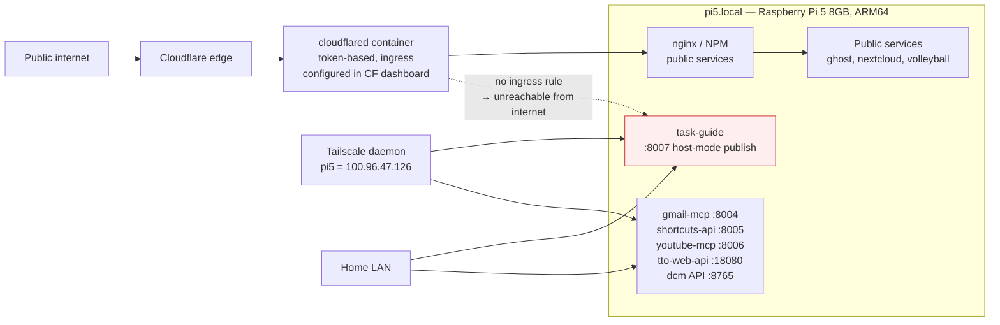

# DCM deployment shape for a .NET service on ARM64

Research resolving [issue #5](https://github.com/jpjerkins/task-guide/issues/5). Investigated 2026-08-01, on `pi5.local` itself (the research session ran on the Pi, so everything below is observed live, not inferred).

**Everything here is planning research. Nothing was deployed, stopped, restarted, or modified.**

---

## TL;DR

- **Shape:** one build-based Docker **Swarm** service, registered in DCM via `POST /deploy`, built from a source tree on the Pi, image pushed to the local registry `localhost:5000/task-guide` and deployed by digest. Bind-mount `/mnt/data/task-guide` → `/data`. Publish one host port (`mode: host`) — that alone makes it tailnet-only.
- **DCM skill:** a skill *file* exists at `~/dev/dcm/skills/dcm.skill.md`, but it is **not installed** anywhere Claude Code loads skills from. Effectively: **no, there is no usable "deploy via DCM" skill today.** There *is* a working `pi5-devops` agent and a full `mcp__dcm__*` MCP toolset.
- **Headroom:** fine. ~4.8 GiB available RAM, load average 0.36. Comparable .NET app images on this box are ~262–265 MB and idle near-zero CPU.
- **Tailnet-only:** already the default. Cloudflare ingress is configured remotely in the Cloudflare dashboard (token-based tunnel), so a new service is public only if someone explicitly adds a hostname. Publishing a host port gets you LAN + tailnet and nothing else.
- **⚠️ Backup is broken.** The `/mnt/data` → `/mnt/backup` routine has not run since **2026-01-30**, is a manual script not in cron, uses `--ignore-existing` (so it never updates changed files even when run), and `/mnt/backup` is **93.6% full**. Dropping data in `/mnt/data/task-guide` does **not** get it backed up. See [Backups](#6-volume-mounts-and-backups).

---

## 1. Sources used

Local, on `pi5.local`:

| Path | What it gave |
|---|---|
| `/mnt/data/nextcloud-appdata/data/phil/files/Notes/2 Areas/Technology/Home Infrastructure.md` | Authoritative topology, storage layout, dev workflow. **Partly stale** — see [Corrections](#9-corrections-to-the-infrastructure-note). |
| `/home/philj/dev/dcm/agent-spec.md` | Authoritative DCM agent guide (also served at `GET /agent-spec`). |
| `/home/philj/dev/dcm/registry.yaml` | Source of truth for every registered service. |
| `/home/philj/dev/dcm/templates/service-spec.schema.yaml` | Documented `ServiceSpec` for `POST /deploy`. Incomplete — see [§3](#3-what-poll-deploy-actually-accepts). |
| `/home/philj/dev/dcm/lib/registry.py` | Real Pydantic models — `ServiceSpec`, `ExposureSpec`, `StackServiceSpec`. |
| `/home/philj/dev/dcm/lib/swarm_renderer.py`, `lib/deployer.py` | How specs become stack YAML. |
| `/home/philj/dev/dcm/services/tto-web-api.stack.yaml` | **Closest analogue** — a .NET service on a published host port with a `/mnt/data` bind. |
| `/home/philj/dev/dcm/services/exercise.stack.yaml` | Another .NET service, internal-only. |
| `/home/philj/dev/TimeTrackerOverkill/TTO.Web.Api/Dockerfile` | The established .NET ARM64 Dockerfile pattern. |
| `/home/philj/dev/dcm/skills/dcm.skill.md` | The uninstalled skill file. |
| `/home/philj/.claude/agents/pi5-devops.md` | The devops agent definition. |
| `/home/philj/backup.sh`, `crontab -l`, `/mnt/backup/data/` | The (broken) backup story. |

Live inspection: `mcp__dcm__dcm_host`, `dcm_registry`, `dcm_status`, plus `free -h`, `ss -tlnp`, `docker images`, `/proc/cmdline`, `tailscale ip`.

---

## 2. How DCM expects a service to be defined

DCM is the only sanctioned way to touch Docker on pi5 (`agent-spec.md` §1). The lifecycle:

1. **Source tree must exist on the Pi** at an absolute path. `POST /deploy` returns `422` if `build.context` doesn't exist. The agent-spec is explicit that the context does **not** have to live under `~/apps/` — "Some services use `~/dev/...`; others may use a different absolute path" (`agent-spec.md` §7 Path B). In practice the newer services build straight from `~/dev/`: `tto-web-api` builds from `/home/philj/dev/TimeTrackerOverkill`, `gmail-mcp` from `/home/philj/dev/gmail-safety-wrapper/mcp`.
2. **`POST /deploy`** with a `ServiceSpec`. DCM then, in order: validates → syncs Tier 2 secrets → creates `/mnt/data/<name>/` if `data_dir: true` → creates a right-sized overlay network → renders `services/<name>.stack.yaml` → appends to `registry.yaml` → builds & pushes the ARM64 image → `docker stack deploy` from the immutable digest.
3. **Upgrades** are `POST /upgrade/<name>` — refresh the source tree first only if it's stale.

The rendered `services/*.stack.yaml` files are **generated, do-not-edit-by-hand** artifacts. `registry.yaml` is the source of truth.

### Runtime: Swarm, not Compose

The registry is mid-migration. Newer services carry `artifact_format: swarm` and render `*.stack.yaml`; older ones are `runtime: compose`. `ServiceSpec.artifact_format` **defaults to `"swarm"`** (`lib/registry.py:397`). Every build-based service registered since ~July 2026 (`tto-web-api`, `shortcuts-api`, `youtube-mcp`, `volleyball-scorekeeper`, `static`, `whiteboard`) is Swarm. `task-guide` should be Swarm too — just take the default.

### The dev → prod path

The infra note describes `~/dev/` → `dcm-promote` → `~/apps/` → build. **This is no longer how the newer services work** — `~/apps/` holds only 4 stale directories and none of the recent services use it. The live convention is: build context points directly at `~/dev/<name>/`, and `dcm-upgrade` rebuilds.

The map's constraint "must not be run live from a source folder under `~/dev`" is still satisfied: the *container* runs from an immutable digest-pinned image in the local registry, and its data lives in `/mnt/data/`. The source tree is only a build input. That is exactly what `tto-web-api` does.

> **Open question for the user.** `~/dev/task-guide` is the working repo. Building the deployed image from that same tree means an uncommitted edit is one `dcm-upgrade` away from production. `tto-web-api` accepts that. If you'd rather not, promote to `~/apps/task-guide` first and point `build.context` there. I have no evidence of a stated preference either way.

---

## 3. What `POST /deploy` actually accepts

⚠️ **The documented schema is incomplete.** `templates/service-spec.schema.yaml` and `agent-spec.md` §5 both describe a small `ServiceSpec` (name, description, image/build, data_dir, secrets, environment, extra_networks). The real model in `lib/registry.py:365–411` accepts considerably more, including everything needed here:

`ports`, `mounts`, `exposure`, `healthcheck`, `replicas`, `command`, `entrypoint`, `env_files`, `update_policy`, `rollback_policy`, `restart_policy`, `runtime` (read-only rootfs, cap_drop, security_opt), `stop_grace_period`, `network_attachments`, `artifact_format`, `stack`.

Validation rules that matter:

- Exactly one of `image` / `build`.
- `exposure.ports` and top-level `ports` are mutually exclusive — use one (`registry.py:409`).
- `ExposureSpec` enforces: `kind: internal` → must declare **no** ports; `kind: published` → must declare **at least one** port (`registry.py:192–198`).

Trust `lib/registry.py` over the schema file.

---

## 4. Proposed deployment shape for `task-guide`

### Registration call

```bash
TOKEN=$(cat ~/secrets/dcm_api_key)
curl -s -X POST -H "Authorization: Bearer $TOKEN" -H "Content-Type: application/json" \
  -d '{
    "name": "task-guide",
    "description": "Opportunistic task reminder system — tailnet only, no auth",
    "build": {
      "context": "/home/philj/dev/task-guide",
      "dockerfile": "src/TaskGuide.Web/Dockerfile",
      "target_image": "localhost:5000/task-guide",
      "platform": "linux/arm64"
    },
    "artifact_format": "swarm",
    "data_dir": true,
    "managed": true,
    "upgrade_strategy": "build",
    "environment": {
      "ASPNETCORE_ENVIRONMENT": "Production",
      "TZ": "America/Chicago"
    },
    "exposure": {
      "kind": "published",
      "ports": [{"target": 8080, "published": 8007, "protocol": "tcp", "mode": "host"}],
      "notes": "Tailnet/LAN only. Never added to Cloudflare tunnel ingress."
    }
  }' http://localhost:8765/deploy
```

`data_dir: true` makes DCM create `/mnt/data/task-guide` and bind it to `/data`. If you want the mount spelled out explicitly (as `tto-web-api` does), pass `mounts: [{type: bind, target: /data, source: /mnt/data/task-guide, read_only: false, purpose: data}]`.

### Resulting stack artifact (what DCM will render)

```yaml
# Generated by dcm swarm render — do not edit by hand
services:
  task-guide:
    image: localhost:5000/task-guide@sha256:...
    environment:
      ASPNETCORE_ENVIRONMENT: Production
      TZ: America/Chicago
    ports:
    - {target: 8080, published: 8007, protocol: tcp, mode: host}
    volumes:
    - {type: bind, target: /data, source: /mnt/data/task-guide}
    networks:
      task-guide: {aliases: [task-guide-task-guide-1]}
    deploy:
      replicas: 1
      update_config: {parallelism: 1, delay: 10s, failure_action: rollback, monitor: 30s, order: stop-first}
      rollback_config: {parallelism: 1, failure_action: pause}
      restart_policy: {condition: any}
networks:
  task-guide: {external: true}
```

**`order: stop-first`, not `start-first`.** `tto-web-api` uses `stop-first`; `exercise` and `volleyball-scorekeeper` use `start-first`. For a service holding an exclusive write lock on JSON files in a bind mount, two replicas overlapping during an update is a corruption risk. Choose `stop-first`.

### Port

Currently listening on the host: `8004` (gmail-mcp), `8005` (shortcuts-api), `8006` (youtube-mcp), `8765` (DCM API), `9000` (whiteboard/portainer), `18080` (tto-web-api). **`8007` is free** and fits the `800x` app-service block. Verified via `ss -tlnp`.

### Dockerfile

Copy the `tto-web-api` pattern verbatim (`/home/philj/dev/TimeTrackerOverkill/TTO.Web.Api/Dockerfile`):

```dockerfile
FROM mcr.microsoft.com/dotnet/sdk:10.0 AS build
WORKDIR /src
COPY . .
RUN dotnet restore <proj>
RUN dotnet publish <proj> -c Release -o /app/publish --no-restore

FROM mcr.microsoft.com/dotnet/aspnet:10.0
WORKDIR /app
COPY --from=build /app/publish .
EXPOSE 8080
ENV ASPNETCORE_URLS=http://+:8080
ENV ASPNETCORE_ENVIRONMENT=Production
ENTRYPOINT ["dotnet", "<App>.dll"]
```

The Pi builds this natively (`platform: linux/arm64`), no cross-build or emulation involved.

---

## 5. Base images and footprint on ARM64

**Measured on the Pi** (`docker images`):

| Image | Size |
|---|---|
| `localhost:5000/tto-web-api` (.NET 10 ASP.NET app) | **265 MB** |
| `localhost:5000/exercise` (.NET app) | **262 MB** |

So the realistic budget for a finished .NET 10 web app image here is **~265 MB**, matching what `mcr.microsoft.com/dotnet/aspnet:10.0` (arm64) costs plus a small app layer.

Options, from what the codebase demonstrates and what Microsoft ships:

- **`mcr.microsoft.com/dotnet/aspnet:10.0`** — the established choice on this box. Debian-based. ~265 MB delivered. **Recommend this.** Boring, matches two other services, zero surprises.
- `…/aspnet:10.0-alpine` — meaningfully smaller (musl-based). Not used anywhere on this Pi. Would be a new, unvalidated variable; ICU/globalization and any native deps need checking. Not worth it for a service where 150 MB of disk is irrelevant.
- `…/runtime-deps` + self-contained / AOT — smallest, but a build-complexity tax with no payoff here.

⚠️ I could **not** verify exact published base-image sizes: `mcr.microsoft.com/dotnet/aspnet:10.0` is not cached on the host (`docker image inspect` → no such image), and this was local-only research. The 262–265 MB app-image figures are directly measured and are the number that actually matters.

The SDK image (`sdk:10.0`, roughly 1.5 GB+) is pulled at build time. Disk is fine: `/` is 45.3% used, and `docker system df` shows **21 GB reclaimable images + 21 GB build cache** already sitting there if space is ever needed.

### Resource headroom — good

From `mcp__dcm__dcm_host` and `free -h`, 2026-08-01:

| Metric | Value |
|---|---|
| RAM used / total | 2.93 / 7.87 GB |
| RAM **available** | **4.8 GiB** |
| Swap used | 1.4 / 2.0 GiB |
| CPU | 9.0%, load avg 0.36 / 0.35 / 0.28 |
| Disk `/` | 45.3% |
| Disk `/mnt/data` | 62.6% |
| Disk `/mnt/backup` | **93.6%** ⚠️ |
| Docker networks | 23, **18 flagged oversized**, 11 `/16` slots left |

~20 containers running including the full NextCloud stack (app, cron, db, redis), n8n, Open WebUI, SearXNG, MySQL, and two existing .NET services. A third small .NET app is comfortably absorbed — expect roughly 100–200 MB RSS at idle for a low-traffic ASP.NET service.

Two caveats:

1. **Swap is 70% used.** Not alarming on a Pi that's been up 12 days, but it means real RAM pressure exists. Worth a glance before deploying.
2. **⚠️ Per-container memory accounting is disabled.** `/proc/cmdline` contains `cgroup_disable=memory`. Consequences: `docker stats` reports `0B` for every container, `mcp__dcm__dcm_status` reports `mem_mb: 0` for all 46 containers, and **Docker memory limits cannot be enforced**. You cannot cap `task-guide`'s memory, and you cannot observe it per-container. Fixing this requires editing the Pi's boot cmdline and rebooting — out of scope here, and a decision for the user.

---

## 6. Volume mounts and backups

### Mounts — settled convention

Every DCM app service binds `/mnt/data/<service-name>` to `/data` inside the container. Confirmed across `tto-web-api`, `volleyball-scorekeeper`, `searxng`, `whiteboard`. `data_dir: true` (the default) makes DCM create the host directory during deploy. So `/mnt/data/task-guide` → `/data`, and the JSON store lives there. This matches the map exactly, no deviation needed.

One thing to plan for: the container's UID must be able to write `/mnt/data/task-guide`. Existing dirs show inconsistent ownership (`tto-web-api` is `philj:philj`, `gmail-mcp` is `50010:50010`, `searxng` is `977:977`). The ASP.NET base image runs as `root` by default unless `USER` is set, which is why nobody has hit this — but it's the first thing to check if writes fail.

### ⚠️ Backups — the routine does not currently work

This is the biggest finding, and the honest answer to "how does `/mnt/data/task-guide` join the existing backup routine" is: **it doesn't, because there is no working routine to join.**

Evidence:

- The only backup mechanism for `/mnt/data` is `/home/philj/backup.sh`, a single line:
  ```
  sudo rsync -rtvopg --delete --delete-before --ignore-existing /mnt/data /mnt/backup
  ```
- It is **not in any crontab** and **not a systemd timer**. `crontab -l` schedules only: a daily brief, a notes backup, a cloudflared keepalive, and a NextCloud DB backup. `systemctl list-timers` shows nothing but stock OS timers.
- `/mnt/backup/data/` was **last written 2026-01-30** — six months ago — and contains 12 directories against 24 in `/mnt/data`. `tto-web-api`, `simple-apps`, `searxng`, `gmail-mcp`, `volleyball-scorekeeper`, `whiteboard` and others have **never been backed up**.
- **`--ignore-existing` is a logic bug.** Even when run, it skips any file that already exists at the destination — so changed files are never updated. It only ever copies genuinely new files. Combined with `--delete`, the semantics are incoherent.
- `/mnt/backup` is **93.6% full**.

What *does* work: `~/backups/notes/backup-notes.sh` (03:00 daily) and `~/backups/nextcloud/backup-nextcloud-db.sh` (03:15 daily). Both are purpose-built per-app scripts writing into `~/backups/`, not the `/mnt/data` sweep.

**Recommendation.** Don't assume `/mnt/data/task-guide` inherits protection. Either (a) treat fixing the `/mnt/data` sweep as prerequisite infrastructure work — drop `--ignore-existing`, put it on a timer, free space on `/mnt/backup` — or (b) follow the pattern that demonstrably works and give `task-guide` its own small cron'd backup script in `~/backups/task-guide/`. Option (b) is smaller and independent; option (a) fixes it for every service at once. This is a decision for the user, and probably deserves its own ticket.

---

## 7. Tailnet-only exposure

**This is the default, not something you configure.** There is no special "internal-only" mechanism to adopt — the public path is the one that takes deliberate action.

Topology as observed:



Mechanics:

- The router forwards **no ports**. `agent-spec.md`: "No services are exposed directly on host ports to the internet — Cloudflare tunnel only."
- `cloudflared` runs with `tunnel run --token …` — the ingress rules live in the **Cloudflare dashboard**, not on disk. A newly-published host port is therefore invisible to the internet until someone explicitly adds a public hostname for it. **Default-deny by construction.**
- A `mode: host` published port binds `0.0.0.0`, which on this box means LAN + tailnet. Reachable at `http://100.96.47.126:8007` or `http://pi5.local:8007`.
- This is exactly how `gmail-mcp`, `shortcuts-api`, `youtube-mcp` and `tto-web-api` are already reached, and how the DCM API itself (`:8765`) is reached. The infra note calls `simple-apps-mcp` "LAN/Tailscale only" — same mechanism.

**Do not** add `task-guide` to the `nginx` or `cloudflared` networks, and **do not** create a Cloudflare public hostname. Set `exposure.notes` to record the intent, as `searxng` does for its internal-only status.

The alternative — `exposure.kind: internal` with no published ports — is what `exercise`, `mysql`, `n8n` and `searxng` use. That reaches the service only from other containers on a shared overlay network, which is wrong here: the iPhone and laptop need to hit it directly. So: `kind: published`, host-mode port.

⚠️ **Not verified.** I did not inspect Tailscale ACLs, so I can't confirm which tailnet devices can reach pi5 on arbitrary ports. Nor did I test that `:8007` is genuinely unreachable from the internet — that requires an off-net probe. The architectural reasoning is sound and matches four existing services, but neither was empirically confirmed.

---

## 8. One container or two?

**One container.** Run the scheduler as a hosted service inside the ASP.NET app.

Reasoning grounded in this environment:

- **Every DCM app service on this Pi is a single container.** Checked all `services/*.stack.yaml`: only the third-party stacks (`nextcloud`, `nginx`) are multi-container. No home-grown app splits web from worker. Two containers would be the first of its kind here, with no precedent to copy.
- **The data store forces it anyway.** The map specifies plain JSON files on a bind mount. Two processes writing the same JSON files across container boundaries means inventing file locking or an IPC protocol. In-process, it's a `SemaphoreSlim` and a shared repository. This is the decisive argument.
- **DCM's spec is single-service-shaped.** `ServiceSpec` describes one container; a second would need the `stack:` escape hatch (`registry.py:396`), which nothing on the Pi uses. Untrodden ground.
- **Resource cost.** Two containers = two .NET runtimes ≈ 100–200 MB extra RSS for no benefit, on a host already using 1.4 GiB of swap.
- **Restraint is a design value.** One process, one log stream, one thing to restart — better fit for the map's stated preferences than an artificial split.

Concretely: a `BackgroundService` (or Quartz.NET / `PeriodicTimer`) hosted in the same app, evaluating availability windows on a minute tick and firing Pushover notifications. If the scheduler ever needs true isolation, splitting later is cheap — but there's no reason to pay for it now.

---

## 9. Corrections to the infrastructure note

`Home Infrastructure.md` (updated 2026-03-09) has drifted. Worth fixing there, not just here:

| Note says | Actually |
|---|---|
| DCM source at `~/dcm/` | **`~/dev/dcm/`**. `~/dcm/` does not exist; `~/dcm.old/` is a March snapshot. |
| `~/bin/dcm-*` symlinks work | **All 9 are dangling** — they point into the nonexistent `~/dcm/bin/`. The scripts live at `~/dev/dcm/bin/`. |
| `~/apps/` is the staging tier, build contexts always point there | Newer services build directly from `~/dev/`. `~/apps/` holds 4 stale dirs. The agent-spec explicitly relaxed this rule. |
| Service table lists 13 services | Registry now has 16, including `tto-web-api`, `youtube-mcp`, `volleyball-scorekeeper`, `searxng`. |
| Everything is Docker Compose | Most services are now Docker **Swarm** (`runtime: swarm`); `artifact_format` defaults to `swarm`. |
| `/mnt/data` "backed up periodically" | Not since 2026-01-30. See [§6](#6-volume-mounts-and-backups). |

Also stale: `agent-spec.md:44` gives the Tailscale address as `100.127.253.68`; `tailscale ip -4` reports **`100.96.47.126`**.

---

## 10. Does a "deploy via DCM" skill exist?

**No — not in any form Claude Code will load.** Definitively checked:

| Location | Result |
|---|---|
| `~/.claude/skills/` | **Does not exist** |
| `/home/philj/dev/task-guide/.claude/skills/` | **Does not exist** |
| Plugin skill dirs under `~/.claude/plugins/` | Installed marketplaces are `ouroboros`, `superpowers`, `mattpocock-skills`, `claude-plugins-official`. **No DCM skill.** |
| Session skill listing | 40+ skills available; **none DCM- or pi5-related**. |

There **is** a written skill file at **`/home/philj/dev/dcm/skills/dcm.skill.md`** — proper frontmatter (`name: dcm`), covering all read and control endpoints. It has simply never been installed. The user's belief that "there should be one" is correct: it was authored (2026-04-05) and then left in the source repo.

Two problems if it were installed as-is:
1. It targets `http://thejerkins.duckdns.org:8765` with no `Authorization` header, while the API requires a Bearer token from `~/secrets/dcm_api_key`. Every documented `curl` in it would return `401`.
2. It documents no `Path B` build-based deployment workflow — the one `task-guide` needs.

**What does work today**, and what should be used instead:

- **`mcp__dcm__*` MCP tools** — `dcm_status`, `dcm_registry`, `dcm_host`, `dcm_networks`, `dcm_service_status`, `dcm_deploy`, `dcm_upgrade`, `dcm_restart`, `dcm_stop`, `dcm_patch_service`, `dcm_secrets_sync`, `dcm_downsize`, `dcm_delete_service`, `dcm_upgrade_all`. Authentication handled by the server. Used throughout this research; all read tools worked.
- **`pi5-devops` agent** (`~/.claude/agents/pi5-devops.md`) — fetches `GET /agent-spec` before acting. Sound design, correct token handling.

**Suggested follow-up ticket:** either install `dcm.skill.md` at `~/.claude/skills/dcm/SKILL.md` after fixing the auth headers and adding the build-based deploy path, or retire the file and lean on the MCP tools + `pi5-devops` agent. Right now it's a trap: a file that looks authoritative and would fail on first use.

---

## 11. Open questions

Things I could not determine and that need the user:

1. **Build context: `~/dev/task-guide` or promote to `~/apps/task-guide`?** Both are supported. `tto-web-api` builds from `~/dev`. No stated preference found.
2. **Backup strategy** — fix the global `/mnt/data` sweep, or write a `task-guide`-specific cron script? Probably its own ticket.
3. **Re-enable memory cgroups?** Requires a boot-config change and reboot. Without it there is no per-container memory visibility or limiting.
4. **Tailscale ACLs** — not inspected. Assumed all the user's devices can reach pi5 on arbitrary ports.
5. **Internet-unreachability of `:8007`** — reasoned, not empirically tested from off-net.
6. **`/mnt/backup` at 93.6%** — needs attention regardless of what `task-guide` does.
7. **.NET version** — `10.0` is what the other two .NET services use, so `10.0` unless there's a reason otherwise.
