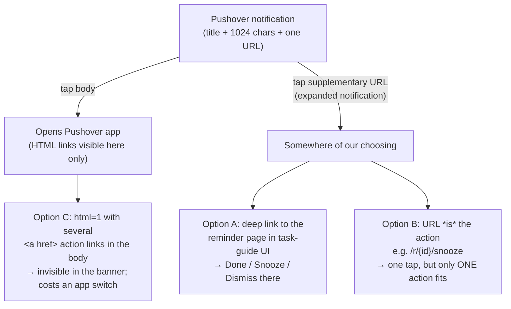

# Pushover API — capabilities and constraints

Research for [issue #3](https://github.com/jpjerkins/task-guide/issues/3). Sources are Pushover's own documentation and support site; every claim below links to where it came from.

Primary sources used:

- [Pushover API — Message API](https://pushover.net/api) (the main reference; most sections below are anchors on this page)
- [Receipts / emergency callbacks](https://pushover.net/api/receipts)
- [Glances API](https://pushover.net/api/glances)
- [Open Client API](https://pushover.net/api/client)
- [Pricing](https://pushover.net/pricing) and [Licensing](https://pushover.net/licensing)
- [Support / knowledge base](https://support.pushover.net/)

---

## Headline answer

**Pushover notifications cannot carry action buttons.** There is no "Done / Snooze / Dismiss" affordance in the notification itself. The only in-notification interaction Pushover offers is **one** supplementary URL (`url` + `url_title`) that the user taps to leave the notification and go somewhere else — plus, for emergency priority only, a single generic **Acknowledge** button whose result the sender *can* observe.

So: snooze and dismiss will happen **in the task-guide UI**, reached by tapping the notification. The notification is a doorbell, not a control surface.

---

## Message format and what a notification can display

[Message API](https://pushover.net/api) — `POST https://api.pushover.net/1/messages.json`.

| Field | Limit / values | Notes |
| --- | --- | --- |
| `token` | 30 chars | Application API token |
| `user` | 30 chars | User key (or group key); up to 50 comma-separated |
| `message` | 1024 UTF-8 chars | Required |
| `title` | 250 chars | Defaults to the application name |
| `url` | 512 chars | Supplementary URL — **one only** |
| `url_title` | 100 chars | Label for that URL |
| `device` | 25 chars, `[A-Za-z0-9_-]` | Comma-separated for several |
| `priority` | `-2 … 2` | See below |
| `sound` | named sound | Per-message override |
| `timestamp` | Unix time | Overrides server receipt time |
| `ttl` | positive seconds | Auto-delete; **ignored for priority 2** |
| `html` | `1` | Mutually exclusive with `monospace` |
| `monospace` | `1` | |
| `attachment` / `attachment_base64` | ≤ 5,242,880 bytes | Image only |

Success returns `{"status":1,"request":"…"}`; emergency messages additionally return a `receipt`. Errors return HTTP 4xx with `{"status":0,"errors":[…]}`.

### Formatting caveat that matters here

With `html=1` Pushover supports `<b>`, `<i>`, `<u>`, `` and `<a href>` — but the docs are explicit that **"HTML tags and monospace formatting are stripped out when displaying your message as a notification"** and that formatting only appears once *"the device client is opened and your message has been downloaded from our servers"* ([#html](https://pushover.net/api#html)).

This kills the obvious workaround. You *could* put three `<a href>` links in the body ("Done", "Snooze", "Dismiss") — but they are invisible in the notification banner. The user must open the **Pushover app** to see them. That is the same number of taps as opening task-guide, and it lands them in the wrong app.

The supplementary `url`/`url_title` is different: the docs say that when the user expands the notification, *"the URL will be shown below it with the supplied `url_title` parameter"*, and tapping it launches the handling app ([#urls](https://pushover.net/api#urls)). That is the one genuinely in-notification affordance — and there is exactly one slot for it.

---

## Priority levels and emergency semantics

From [#priority](https://pushover.net/api#priority):

| Priority | Behaviour |
| --- | --- |
| `-2` Lowest | No notification at all; iOS badge only |
| `-1` Low | No sound or vibration; silent banner |
| `0` Normal | Sound/vibration per the user's device settings |
| `1` High | **Bypasses the user's quiet hours**; always sounds and vibrates |
| `2` Emergency | Repeats until acknowledged; requires `retry` and `expire` |

Emergency (`2`) requires `retry` (minimum 30 seconds between repeats) and `expire` (maximum 10800 seconds = 3 hours, and capped at 50 total retries). It accepts an optional `callback` URL and optional `tags`.

**Emergency priority is the wrong tool for this system.** It is a repeating alarm that nags until the user taps Acknowledge, which is the precise behaviour the user has said they dislike. It is also semantically wrong: acknowledging an emergency means "I saw it", which — given the decoupling rule — is exactly the ambiguous signal we must not let mutate tasks. It is worth knowing it exists, and worth deliberately not using it.

---

## Can the sender observe the user's response?

**Only for emergency priority.** For priority `-2`…`1` Pushover gives the sender *nothing*: no delivery-read signal, no tap event, no callback. The API call returns a request id and that is the end of the story.

For priority `2` ([Receipts API](https://pushover.net/api/receipts)):

- `GET https://api.pushover.net/1/receipts/{receipt}.json?token=…` — poll no faster than once every 5 seconds. Returns `acknowledged`, `acknowledged_at`, `acknowledged_by`, `acknowledged_by_device`, `last_delivered_at`, `expired`, `expires_at`, `called_back`, `called_back_at`.
- `callback` URL receives a POST containing `receipt`, `acknowledged`, `acknowledged_at`, `acknowledged_by`, `acknowledged_by_device`. Pushover retries after one minute if it does not get a 2xx.
- Cancel retries: `POST /1/receipts/{receipt}/cancel.json`, or `POST /1/receipts/cancel_by_tag/{tag}.json` for messages sent with `tags`.

Note the callback carries **no user-chosen payload** — it is a single boolean "acknowledged". It cannot distinguish "done" from "snooze" from "go away". A callback URL would also have to be publicly reachable, which contradicts the Tailscale-only deployment decision. Both facts point the same way: don't build the reminder loop on receipts.

---

## The realistic options for expressing snooze / dismiss

- **Option A (recommended default)** — `url_title` reads something like "Open reminder", `url` points at a per-reminder page on the Tailscale hostname. Everything (snooze, dismiss, and separately marking tasks done) lives in the UI, which also honours the map's "everything doable via the API must be doable through the UI" rule.
- **Option B** — spend the single URL slot on the *one* action most worth saving a tap on. Snooze is the likeliest candidate. The endpoint would be an idempotent GET that snoozes and then renders the reminder page, so it degrades into Option A.
- **Option C** — usable as a *supplement* to A (the links are there if the user happens to open Pushover) but never as the primary mechanism.

### Constraint the parent session should weigh: Tailscale-only + notification links

The map fixes the service as Tailscale-only, no public exposure. A notification URL pointing at `http://task-guide.<tailnet>.ts.net/...` **only works if the phone is on the tailnet at that moment**. Tailscale on iOS/Android is usually always-on, so this is likely fine — but it is an unverified assumption, and it bites hardest for "away" reminders, which are exactly the ones the user will be acting on out of the house. Worth confirming on the actual device before the spec locks. There is no Pushover-side workaround: Pushover never fetches the URL itself, it just hands the string to the OS.

---

## Rate limits, quotas, cost

From [#limits](https://pushover.net/api#limits) and [Pricing](https://pushover.net/pricing):

- **10,000 messages per month, free**, shared across *all* applications on the account. Teams get 25,000.
- One message = one successful `messages` call **to one user**, regardless of how many devices that user has. Group keys count once per member.
- Limits reset at **00:00:00 Central Time on the 1st of each month**.
- Exceeding the quota returns **HTTP 429** for every application on the account.
- Every response carries `X-Limit-App-Limit`, `X-Limit-App-Remaining`, `X-Limit-App-Reset`; also queryable at `GET /1/apps/limits.json?token=…`.
- Client friendliness: **max 2 concurrent TCP connections**; on 5xx wait ≥ 5 seconds before retrying; on 4xx do not retry without changing the input. Repeated 4xx in a short window can get the IP temporarily blocked.
- **Cost: $4.99 USD one-time per platform** (iOS / Android / Desktop), after a 30-day free trial. No subscription. Teams is $5/user/month and is not relevant here. Creating an application / API token is free.

A restraint-valuing system sending, say, 10 reminders a day uses ~300 messages a month — 3% of the free quota. **Quota is a non-issue and should not shape the design.** The design pressure on notification volume is entirely about the user's tolerance, not Pushover's limits.

Also noted: unverified messages are deleted from Pushover's servers after 21 days.

---

## Delivery targeting, sounds, quiet hours

- **Per-device**: `device` targets one or more named devices. Useful if the phone should get reminders but a desktop client should not.
- **Sounds**: `sound` picks a built-in or user-uploaded sound per message ([#sounds](https://pushover.net/api#sounds)); omit it to use the user's default. A distinct, quiet sound for task-guide is cheap and worth doing — it makes the notification identifiable without being loud.
- **Quiet hours**: a *user-account* setting configured in the Pushover client / [settings](https://pushover.net/settings/quiet_hours). During quiet hours, messages are delivered **as though they had priority `-1`** — silent banner, no sound. Priority `1` bypasses quiet hours entirely.

### How quiet hours interacts with a restraint-valuing system

Pushover's quiet hours is a *second, independent* schedule that can silence reminders. task-guide's availability windows are supposed to be the single source of truth for when the user gets bothered. Two implications:

1. **Never send priority `1`.** Nothing this system produces is worth overriding the user's own do-not-disturb. Priority `0` for normal reminders, `-1` for low-value or catch-up ones, is the right ceiling. This is a design rule worth writing into the spec, not just a default.
2. **Quiet hours is a backstop, not the mechanism.** If a window is configured such that it fires during quiet hours, the reminder arrives silently and is easy to miss — which looks like a bug from the user's side. The scheduling model should avoid emitting windows during known sleep hours in the first place, and quiet hours should just be the belt to that braces.

`ttl` is a genuinely useful restraint lever: setting `ttl` to the remaining life of the availability window means stale reminders clean themselves up instead of accumulating. **Uncertain:** the docs describe `ttl` as auto-deleting the *message*; I could not confirm from primary sources whether an already-delivered notification is also removed from the phone's notification centre when the TTL expires, or only the stored copy in the Pushover app. Worth a five-minute empirical test before relying on it.

---

## Authentication model and stored credentials

There is no OAuth, no token refresh, no per-request signing. Two static secrets:

- **Application API token** — obtained by registering an application at [pushover.net/apps/build](https://pushover.net/apps/build).
- **User key** — the recipient's key, visible on their [dashboard](https://pushover.net/).

Both are sent as plain form parameters over HTTPS on every call. `POST /1/users/validate.json` verifies a token/user (and optionally device) pair and returns the account's `devices` and `licenses` — a decent startup health check.

For task-guide: two long-lived secrets in the service's configuration, never in the repo, injected via the DCM deployment. They do not expire, so there is no refresh machinery to build. Compromise impact is limited to "someone can send this user notifications", which is annoying rather than dangerous — but the token also shares the 10,000/month quota, so a leaked token could exhaust it.

---

## Self-hosted senders and the Open Client

- **Sending is already fully self-hostable.** It is a plain HTTPS POST from the Pi; nothing about task-guide's deployment shape is constrained by Pushover beyond needing outbound internet access to `api.pushover.net`. Note that this is the one external dependency in an otherwise Tailscale-sealed system.
- **[Open Client API](https://pushover.net/api/client)** lets you write your own *receiving* client: log in with email/password for a session secret, register a device with OS type `O`, poll `messages.json`, acknowledge with `update_highest_message.json`, and hold a WebSocket to `wss://client.pushover.net/push` for realtime (single-byte frames: `#` keep-alive, `!` new message, `R` reload, `E` error, `A` session conflict). Licensing treats an Open Client as a desktop device — a Desktop license must be bought within 30 days.
  - **This does not solve the actions problem.** An Open Client is a client *you* write, and the user's phone runs the official iOS app, not yours. It is only interesting if a Pi-side process ever needs to consume Pushover messages, which this system does not.
- **[Glances API](https://pushover.net/api/glances)** — `POST /1/glances.json` pushes `title` / `text` / `subtext` / `count` / `percent` to a widget **without producing a notification or sound**. This is a genuinely interesting fit for the restraint value: an ambient "3 tasks fit this window" surface that costs the user nothing. **But** the docs say the Apple Watch is currently the *only* supported widget (iOS/Android widgets described as future), updates can take up to 10 minutes, and watchOS caps it at 50 updates/day with ~20 minutes recommended between calls. Treat as a possible nice-to-have contingent on the user owning an Apple Watch, not as a design foundation.

---

## Gaps, uncertainties, and conflicting information

Being explicit, per the research convention:

1. **No official Pushover statement on actionable notifications.** The absence of action buttons is established by their API reference simply not offering them. The *reason* and the *roadmap* are only visible through community feature requests — [i231 Actionable notifications](https://support.pushover.net/i231-actionable-notifications), [i100 Button "Done"](https://support.pushover.net/i100-button-done), [i269 Acknowledge emergency notifications via Android actionable notifications](https://support.pushover.net/i269-acknowledge-emergency-notifications-via-android-actionable-notifications). These threads have supporters and community replies but **zero employee responses**, and one poster states a prior identical request was declined for lack of iOS support at the time. Conclusion: not supported today, no evidence it is coming, and I could not find an authoritative "never" either. Design as though it will never exist.
2. **Notification expansion behaviour is platform-specific and unverified.** The docs say the supplementary URL appears "when a user expands the notification". Exactly how many gestures that is on the user's actual iPhone (and whether it is reachable from the lock screen) I could not determine from primary sources. If Option B (URL-is-the-action) is being seriously considered, this is worth testing on the device first — it decides whether the "one-tap snooze" is actually one tap.
3. **`ttl` and already-delivered notifications** — see above; unresolved.
4. **Cost of additional message capacity** beyond 10,000/month is referenced by the API docs ("see our Knowledge Base") but I did not find a published figure. Irrelevant at this system's volume.
5. **Tailscale reachability from a notification tap** is an assumption about the user's device configuration, not a documented Pushover behaviour. Flagged above as the item most likely to force a design change.
6. I did not test any of this against the live API — this is documentation research only, as scoped.
