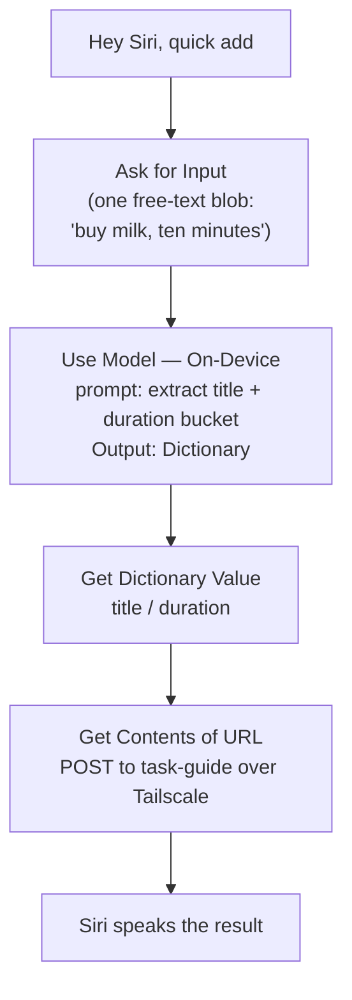

# Siri and Shortcuts capture ergonomics

Research for [issue #13](https://github.com/jpjerkins/task-guide/issues/13). Planning only —
nothing built.

**Version basis.** The Shortcuts User Guide's version selector currently tops out at
**iOS 26**, and Apple's "What's new in Shortcuts" article was last updated for **iOS 26.4**
(published 26 March 2026)
([Apple Support HT125148](https://support.apple.com/en-us/125148)). WWDC26 sessions describe
"the 27 releases" as forthcoming
([WWDC26 session 240](https://developer.apple.com/videos/play/wwdc2026/240/)). So: findings
below are **iOS 26.x unless stated**, and the iOS 27 material is pre-release.

---

## Bottom line

**Rich natural-language capture in one spoken phrase is not available — and it is not
available even if we shipped a native app.** Apple's constraint is stricter than the issue
assumed. The interesting finding is not the limit itself but *where* it lands:

1. A **user-built Shortcut** is triggered by Siri saying **its name, and nothing else**. There
   is no documented mechanism for supplying any parameter, named or positional, in the spoken
   phrase.
2. An **App Intents App Shortcut** (native app) allows **at most one parameter per phrase**, and
   that parameter **may not be an open-ended string**. "Add task buy milk, ten minutes" is out
   of reach for a native app too.
3. The one genuinely new capability is the **`Use Model` action (iOS 26, Apple Intelligence
   required)**: capture one blob of text, have an on-device model parse it into structured
   fields, then POST. This is a real path for a web-backed service with no app, and it is the
   only thing here that changes the shape of the two-Shortcut plan.

So the plan settled in #2 survives, with one addition. See [§7](#7-what-this-means-for-the-plan).

---

## 1. Can a user-built Shortcut take named parameters in one spoken phrase?

**No.** Apple documents exactly one Siri invocation model for user-built shortcuts:

> "Activate Siri on your iPhone or iPad, HomePod, Apple Watch, or Mac, then say the name of a
> shortcut, such as 'Text Last Image.' After running the shortcut, Siri tells you the result."
>
> — [Use Siri to run shortcuts with your voice](https://support.apple.com/guide/shortcuts/run-shortcuts-with-siri-apd07c25bb38/ios) (iOS 26)

That page is the whole of it. It documents the name-only trigger, the locked-device caveat, and
a note that a shortcut name colliding with a standard Siri command wins over the standard
command. **Parameters, arguments, or extra spoken words are not mentioned anywhere on it.**

This is an argument from silence, so it is worth corroborating structurally. A shortcut has
exactly **one** input slot — "Shortcut Input" — and it is *typed*, not named:

> "When you first enable a shortcut to run from another app, the shortcut will accept any
> content as an input. Limiting the type of content that a shortcut will accept streamlines
> sharing options in an app… Turn off any content type you don't want as input for your
> shortcut."
>
> — [Limit the input for a shortcut](https://support.apple.com/guide/shortcuts/limit-the-input-for-a-shortcut-apd8195f96d6/ios)

The URL scheme confirms the same single-slot shape from the other direction — one `input`, one
`text`, no named fields:

```
shortcuts://run-shortcut?name=[name]&input=[input]&text=[text]
```

> "`input` (optional): The initial input into the shortcut. There are two input options: a text
> string or the word `clipboard`."
>
> — [Run a shortcut using a URL scheme](https://support.apple.com/guide/shortcuts/run-a-shortcut-from-a-url-apd624386f42/ios)

There is no named-parameter surface in the data model, so there is nothing for a spoken phrase
to bind to.

**Gap I could not close:** Apple nowhere states affirmatively that Siri *discards* trailing
words after the shortcut name, nor that it *does not* route them into Shortcut Input. I found no
primary source either way. Treat "trailing words are ignored" as strongly implied but formally
unconfirmed, and worth a five-minute empirical test on-device before designing around it.

**Consequence:** the shortcut *name* is the only thing carried by voice, which is exactly why
the #2 plan reached for multiple named shortcuts and duration buckets. That instinct was right.

---

## 2. Do unsupplied parameters fall back to defaults, or does Siri prompt?

For a user-built Shortcut the question partly dissolves — there are no parameters to leave
unsupplied. What exists instead is **runtime prompting**, and it is opt-in per action, not a
fallback:

- **Ask for Input** — "a powerful action that lets you enter information at the time your
  shortcut is run. The action presents a dialog that asks a question." It "allows you to specify
  a default value that **prefills the dialog**. When you run the shortcut, you can adjust the
  prefilled information."
  ([Use the Ask for Input action](https://support.apple.com/guide/shortcuts/use-the-ask-for-input-action-apd68b5c9161/ios))

  Note carefully: the default **prefills a prompt you still have to dismiss**. It is not a
  "skip the prompt if a value exists" default. Apple documents no mechanism for suppressing the
  prompt when a default is present.

- **Ask Each Time** — "the shortcut **pauses**, prompting you to update the action's parameters.
  Once you select Done, the shortcut continues its run."
  ([Use the Ask Each Time variable](https://support.apple.com/guide/shortcuts/use-the-ask-each-time-variable-apd8b28e2166/ios))

- **Shortcut Input**, when absent, *does* have a documented fallback ladder — the only true
  default-handling in the system. Tapping Continue in the input action offers: *Stop and
  Respond*, *Ask For* (ask for input of a given type), *Get Clipboard*, or *Continue* ("the
  shortcut runs without interruption. If an action uses the input as a Magic Variable, the
  variable will be empty").
  ([Limit the input for a shortcut](https://support.apple.com/guide/shortcuts/limit-the-input-for-a-shortcut-apd8195f96d6/ios))

So the honest answer: **every value you want optional-with-a-default has to be baked into the
shortcut's structure at build time** (a hardcoded value, or a separate shortcut), because any
runtime prompt is unconditional. This is the mechanical reason the two-shortcut split in #2 is
the right shape rather than one shortcut with optional fields.

By contrast, App Intents *do* prompt for missing parameters, and do so aloud — see §3.

---

## 3. Does this require App Intents (and a native app)?

**App Intents is required for anything richer — and even then, "Add task buy milk, ten minutes"
is not achievable.** This was the most surprising finding and it is well-sourced.

### One parameter per phrase, maximum

> "Phrases can also contain a single parameter reference."
>
> — [WWDC22 session 10170, *Implement App Shortcuts with App Intents*](https://developer.apple.com/videos/play/wwdc2022/10170/)

```swift
phrases: [
    "Start a \(\.$session) session with \(.applicationName)"
]
```

Every phrase must include the `.applicationName` token, which "allows Siri to insert not only my
application's main name, but also any app name synonyms that I've configured" (same session).

This is enforced at build time. The compiler emits:

> "Error: Multiple parameters detected in phrase. A single phrase can only use a single
> parameter."

and an Apple engineer in that thread adds that even *repeating the same* parameter fails:
`"Select ${model} in ${applicationName} for ${model}"` is rejected.
([Apple Developer Forums thread 779109](https://developer.apple.com/forums/thread/779109) — Apple-hosted,
and the error string itself is first-party, though a forum reply is weaker than documentation.)

### And the parameter cannot be free text

This is the decisive one:

> "Parameters are not meant for open-ended values. For example, **it's not possible to gather an
> arbitrary string from the user in the initial utterance**."
>
> — [WWDC22 session 10170](https://developer.apple.com/videos/play/wwdc2022/10170/)

Phrase parameters resolve against a **fixed set** — an `AppEntity` or `AppEnum`. A task *title*
is arbitrary free text by definition. So the utterance "Add task buy milk, ten minutes" fails
twice over for a native app: two parameters, one of which is an open string.

What a native app *would* buy us is a spoken duration bucket, e.g. `"Add a \(\.$duration) task
with \(.applicationName)"` where `duration` is an `AppEnum` of the five buckets — then Siri asks
for the title. That is a genuinely nicer flow, but it is one native app away, and it still takes
two turns.

**Caveat on age:** the quotes above are WWDC22 and I could not find them restated in current
reference documentation. The [AppShortcut](https://developer.apple.com/documentation/appintents/appshortcut)
and [AppShortcutPhrase](https://developer.apple.com/documentation/appintents/appshortcutphrase)
reference pages are stubs that state neither rule. The compiler error in the 2025-era forum
thread shows the one-parameter rule is still live; I have **no equally recent confirmation** for
the no-open-strings rule, only that the reference docs still describe `AppShortcutPhraseToken`
as offering exactly one token, `applicationName`.

### iOS 27 / App Schemas — multi-parameter utterances, but still native-app-only

WWDC26 session 240 describes a materially different Siri:

> "App schemas give Siri a predefined understanding of common concepts, like messages, contacts,
> or documents. When your entities conform to a schema, Siri already knows how to reason about
> them… Schemas define the kinds of actions Siri understands, the structure it expects, and how
> those actions map to natural language."

and demonstrates genuinely multi-parameter natural language:

> "Send a message to Glow in UnicornChat, saying 'What movies do you recommend?'"

— [WWDC26 session 240, *Build intelligent Siri experiences with App Schemas*](https://developer.apple.com/videos/play/wwdc2026/240/)

So the "one parameter, no free text" ceiling is being lifted **in the 27 releases** — but only
for apps adopting App Intents schemas. This is pre-release, subject to change, and (given the
history of the 2024 Siri announcements slipping) worth treating as a maybe. It does not help a
web-backed service. Apple's own framing confirms the requirement: schemas are "a contract
between your app and the system", built on `AppIntent`/`AppEntity` types compiled into an app
([Apple Intelligence and Siri AI](https://developer.apple.com/documentation/appintents/apple-intelligence-and-siri-ai)).

### Is there a path short of shipping an app?

Three, in descending order of usefulness:

1. **`Use Model` in a plain Shortcut** — the real one. See §5.
2. **Multiple narrowly-named Shortcuts** — the #2 plan. Voice-addressable, zero dependencies,
   works on every device including HomePod and Watch.
3. **Piggyback on Reminders** — Siri already does excellent free-text capture into Reminders
   ("remind me to buy milk"). But **there is no "reminder created" automation trigger on iOS**:
   the documented personal-automation triggers are event (time of day, alarm, sleep, workout,
   sound recognition), travel, communication, transaction, and setting triggers
   ([Intro to personal automation](https://support.apple.com/guide/shortcuts/intro-to-personal-automation-apd690170742/ios),
   [Event triggers](https://support.apple.com/guide/shortcuts/event-triggers-apd932ff833f/ios)).
   So this degrades to a **polling sync** on a Time of Day trigger, it loses duration entirely,
   and it makes Reminders the system of record for capture. Mentioned for completeness; I would
   not build it.

Worth noting the inverse direction *is* documented, and is a small nicety: with a shortcut open,
saying "Remind me about this" files it into Reminders
([Add a shortcut to Reminders using Siri](https://support.apple.com/guide/shortcuts/add-a-shortcut-to-reminders-using-siri-apdacfdf1802/ios)).

---

## 4. What does the hands-free flow actually look like?

**This is the weakest-evidenced section, and I want to be blunt about that.**

### What is documented

- Siri "can launch shortcuts from most of your devices, including HomePod and Apple Watch", and
  "after running the shortcut, Siri tells you the result"
  ([Run shortcuts with Siri](https://support.apple.com/guide/shortcuts/run-shortcuts-with-siri-apd07c25bb38/ios)).
  So **output** is spoken. That much is clear.
- For **App Intents** — not user shortcuts — spoken prompting is explicitly documented:

  > "Disambiguations asks the user to select from a fixed list… When run from Siri, **Siri will
  > speak out the questions**. [In Spotlight or the Shortcuts app] the user will be presented
  > with the same prompt in a touch-driven UI."
  >
  > — [WWDC22 session 10170](https://developer.apple.com/videos/play/wwdc2022/10170/)

  Note what this tells us: the *App Intents* framework has a deliberate voice/touch dual
  rendering for its prompts. That is a framework feature of App Intents, described in App
  Intents material.

### What is not documented

Apple's user-guide pages for the user-Shortcut prompting actions describe **screen and keyboard
affordances only**, with no voice rendering mentioned:

- Ask for Input "presents a **dialog**… When you **enter the answer and tap Done**, the data is
  passed into the next action". "Ask for Input supports the entry of words, dates, or numbers,
  and **the keyboard adapts** to each input type." The page's only tip is about the Shortcuts
  widget and the Apple Watch numeric keypad.
  ([source](https://support.apple.com/guide/shortcuts/use-the-ask-for-input-action-apd68b5c9161/ios))
- Ask Each Time: "the shortcut pauses, prompting you to update the action's parameters. Once you
  **select Done**, the shortcut continues."
  ([source](https://support.apple.com/guide/shortcuts/use-the-ask-each-time-variable-apd8b28e2166/ios))
- Choose from Menu: "lets you decide what a shortcut should do when it's run. You choose from a
  predefined list of options… Choose from Menu lets you pick only one option." Described purely
  as a visual fork, with markers in the editor. **Siri and voice are not mentioned at all.**
  ([source](https://support.apple.com/guide/shortcuts/use-the-choose-from-menu-action-apdd7bf369da/ios))

**I could not confirm from any primary source** that Ask for Input becomes a spoken question, or
that Choose from Menu options are read aloud and selectable by voice, when a user-built shortcut
is run hands-free. I searched the Shortcuts User Guide (iOS and Mac editions), the HomePod guide,
and Apple Support articles. The documentation is genuinely silent, not merely unhelpfully worded.

Two further unknowns in the same area:

- Search results surfaced a claim that Siri runs shortcuts on HomePod/Watch "as long as the
  shortcut doesn't include an action that opens an app". **That sentence does not appear** in
  the current iOS or Mac guide pages I fetched; both say only "most of your devices, including
  HomePod and Apple Watch". Either it was removed or it was never Apple's wording. Unresolved.
- Whether a hands-free prompt accepts dictation, and what happens on a screenless device
  (HomePod) when a shortcut hits an Ask for Input, is undocumented.

**Recommendation:** this is cheap to settle empirically and expensive to guess at. Before
committing to any design that leans on a spoken prompt, build a two-action throwaway shortcut
(Ask for Input → Show Result), trigger it by voice with the phone face-down, and again from
HomePod. Ten minutes, and it converts the largest unknown here into a fact. **Until then, design
so that the happy path needs no prompt at all** — which the #2 plan already does.

---

## 5. `Use Model` — the one thing that changes the picture (iOS 26, Apple Intelligence)

New in the iOS/iPadOS/macOS/watchOS/visionOS 26 cycle:

> "**Use Model**, requires Apple Intelligence — 'Use Model' allows you to tap directly into Apple
> Intelligence models or ChatGPT and provide responses that feed into the rest of your shortcut
> (iOS, iPadOS, and macOS)."
>
> — [What's new in Shortcuts for … 26](https://support.apple.com/en-us/125148)

The iPhone User Guide gives the mechanics:

> "You can create your own custom shortcuts that use an Apple Intelligence model — either
> on-device or Private Cloud Compute — or ChatGPT… You can use a model to **provide input to an
> action, parse the output of an action**, and more."
>
> Model choice: **On-Device** ("handle simple requests **without the need for a network
> connection**"), **Private Cloud Compute**, or **Extension Model** (ChatGPT).
>
> "The text input into models can include variables, outputs from previous actions…"
>
> "You can also **specify how the response is output**: When you add the Use Model action, tap
> the Output pop-up menu and choose an option."
>
> — [Use Apple Intelligence in Shortcuts on iPhone](https://support.apple.com/guide/iphone/use-apple-intelligence-in-shortcuts-iph78c41eaf8/ios)

**This gives us the natural-language parse that Siri itself will not do.** The flow:



Honest caveats, all of them load-bearing:

- **It still needs one prompt** to get the text in. It does not remove a turn; it removes the
  *second* turn (the duration pick). Whether that prompt works hands-free is exactly the §4
  unknown.
- **Version- and hardware-gated**: iOS 26+, Apple Intelligence-capable device, Apple Intelligence
  turned on, supported language. Apple still labels Apple Intelligence "available in beta"
  ([HT125148](https://support.apple.com/en-us/125148) footnote).
- **Non-deterministic.** Apple's own footnote: "Apple Intelligence uses generative models and
  outputs may vary. Check important information for accuracy." A capture path that silently
  mis-buckets a duration is worse than one that asks.
- **The exact Output options are not enumerated** in Apple's documentation — the guide says only
  "choose an option" from a pop-up. Whether a strict JSON/Dictionary output is offered, and
  whether it is schema-constrained, I **could not confirm**. This is the single biggest gap
  between "nice diagram" and "working shortcut", and it needs hands-on verification.
- `Follow Up` exists — "it shows you the model's response and allows you to refine your input
  before the final response is passed to the next action" — but that is an interactive review
  step, i.e. the opposite of hands-free. Leave it off.

---

## 6. Version-gating summary

| Finding | Applies to |
|---|---|
| Siri runs a user Shortcut by name only; no spoken parameters | iOS 26 guide; unchanged as far back as the guide's iOS 14 edition |
| Single typed Shortcut Input; no named parameters | iOS 26 |
| Ask for Input / Ask Each Time prompt unconditionally; defaults only prefill | iOS 26 |
| App Shortcut phrase: max one parameter, must be `AppEntity`/`AppEnum`, no free strings | iOS 16+ (WWDC22); one-parameter rule still enforced as of the 2025 forum thread |
| App Intents disambiguation questions are spoken by Siri | iOS 16+ (WWDC22) |
| `Use Model` action | iOS/iPadOS/macOS 26, Apple Intelligence required |
| Shortcuts in Spotlight can accept input | macOS 26 only |
| `Set Battery Charge Limit`, `Set Multitasking Mode`, multi-stop `Open Directions` | 26.4 |
| App Schemas: multi-parameter natural-language utterances | "the 27 releases" — pre-release, native apps only |

Nothing in the 26 or 26.4 release notes touches Siri's *invocation* of user-built shortcuts. The
Siri-facing improvements in this era are all on the App Intents side.

---

## 7. What this means for the plan

**Keep the two-Shortcut plan from #2. It is correct, and for firmer reasons than we had.**

- *Quick add* (title + five duration buckets) and *Add task with details* remain the right
  shape, because Apple gives us **no way to make a prompt conditional**. Multiple
  narrowly-scoped, distinctly-named shortcuts is not a workaround — it is the intended idiom,
  since the name is the only thing voice carries.
- The finding that duration is the only must-supply property (#2) is doubly vindicated: with one
  free parameter and no free-text parameter available *even to a native app*, a design needing
  two spoken fields would have been unbuildable.
- **Shortcut naming now matters more than expected.** The name *is* the entire voice interface,
  and it overrides standard Siri commands on collision. Names should be short, distinct, and
  unlikely to collide — and the collision behaviour is a documented feature we can lean on.

**Two changes I would make:**

1. **Add a third, optional shortcut — "Quick add smart"** — using `Use Model` to parse one spoken
   blob into title + duration. Treat it as an *enhancement layered on top of*, not a replacement
   for, the deterministic Quick add: it is beta-gated, hardware-gated, and non-deterministic.
   Ship the reliable one first. This is the only respect in which the answer to #13's "if richer
   voice capture is possible, that plan changes shape" is yes.
2. **Do not plan a native app for capture ergonomics.** The ceiling for a native App Shortcut
   (one non-string parameter) is barely above what we get for free, and the iOS 27 App Schemas
   work that would change that is unreleased and unproven. If an app is ever built, build it for
   other reasons.

**Before building, settle these empirically** (all cheap, none blocking the design):

- Does a spoken trigger route trailing words into Shortcut Input, or discard them? (§1)
- Does Ask for Input speak its question and accept dictation when triggered hands-free — on
  iPhone, and on HomePod? (§4)
- Are Choose from Menu options read aloud and voice-selectable? (§4)
- What Output formats does `Use Model` actually offer, and is a Dictionary/JSON output
  schema-constrainable? (§5)

---

## Sources

Primary, first-party only. Everything above is drawn from these; nothing rests on third-party
write-ups.

**Shortcuts User Guide (iOS 26)**
- [Use Siri to run shortcuts with your voice](https://support.apple.com/guide/shortcuts/run-shortcuts-with-siri-apd07c25bb38/ios)
  · [Mac edition](https://support.apple.com/guide/shortcuts-mac/run-shortcuts-with-siri-apd07c25bb38/mac)
- [Intro to using prompts](https://support.apple.com/guide/shortcuts/intro-to-using-prompts-apd8efa49a70/ios)
- [Use the Ask for Input action](https://support.apple.com/guide/shortcuts/use-the-ask-for-input-action-apd68b5c9161/ios)
- [Use the Ask Each Time variable](https://support.apple.com/guide/shortcuts/use-the-ask-each-time-variable-apd8b28e2166/ios)
- [Use the Choose from Menu action](https://support.apple.com/guide/shortcuts/use-the-choose-from-menu-action-apdd7bf369da/ios)
- [Limit the input for a shortcut](https://support.apple.com/guide/shortcuts/limit-the-input-for-a-shortcut-apd8195f96d6/ios)
- [Run a shortcut using a URL scheme](https://support.apple.com/guide/shortcuts/run-a-shortcut-from-a-url-apd624386f42/ios)
- [Run app shortcuts](https://support.apple.com/guide/shortcuts/run-app-shortcuts-apd43295406d/ios)
- [Add a shortcut to Reminders using Siri](https://support.apple.com/guide/shortcuts/add-a-shortcut-to-reminders-using-siri-apdacfdf1802/ios)
- [Intro to personal automation](https://support.apple.com/guide/shortcuts/intro-to-personal-automation-apd690170742/ios)
  · [Event triggers](https://support.apple.com/guide/shortcuts/event-triggers-apd932ff833f/ios)

**Apple Support articles**
- [What's new in Shortcuts for iOS, iPadOS, macOS, watchOS, and visionOS 26](https://support.apple.com/en-us/125148) (updated for 26.4, 26 March 2026)
- [Use Apple Intelligence in Shortcuts on iPhone](https://support.apple.com/guide/iphone/use-apple-intelligence-in-shortcuts-iph78c41eaf8/ios)

**Apple Developer**
- [WWDC22 session 10170 — Implement App Shortcuts with App Intents](https://developer.apple.com/videos/play/wwdc2022/10170/)
- [WWDC26 session 240 — Build intelligent Siri experiences with App Schemas](https://developer.apple.com/videos/play/wwdc2026/240/) (pre-release)
- [WWDC26 session 310 — What's new in Shortcuts](https://developer.apple.com/videos/play/wwdc2026/310/)
- [App Shortcuts (App Intents)](https://developer.apple.com/documentation/appintents/app-shortcuts)
  · [AppShortcut](https://developer.apple.com/documentation/appintents/appshortcut)
  · [AppShortcutPhrase](https://developer.apple.com/documentation/appintents/appshortcutphrase)
  · [AppShortcutPhraseToken](https://developer.apple.com/documentation/appintents/appshortcutphrasetoken)
- [Apple Intelligence and Siri AI](https://developer.apple.com/documentation/appintents/apple-intelligence-and-siri-ai)
- [Developer Forums thread 779109 — "A single phrase can only use a single parameter"](https://developer.apple.com/forums/thread/779109)
  (Apple-hosted; quotes a first-party compiler error, but a forum reply is weaker evidence than documentation)

**Sources that did not pan out.** The Human Interface Guidelines page on App Shortcuts
(`developer.apple.com/design/human-interface-guidelines/app-shortcuts`) is a JavaScript-rendered
SPA with no reachable data endpoint; I could not retrieve its text and have not cited it. The
`AppShortcut` and `AppShortcutPhrase` reference pages are near-empty stubs and confirm neither
the one-parameter nor the no-free-strings rule — which is why §3 leans on the WWDC22 transcript.
