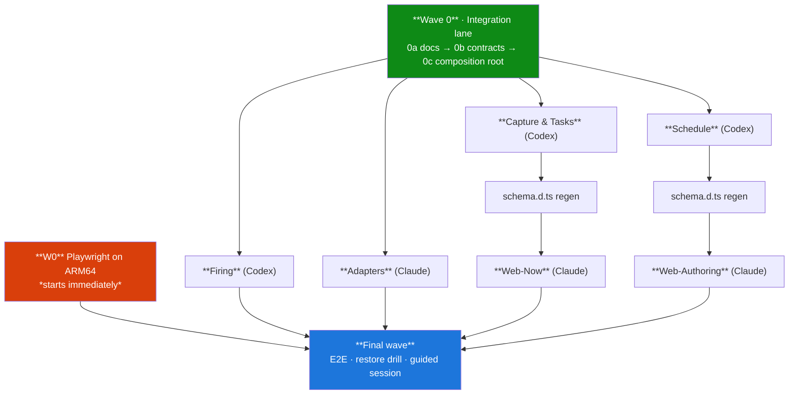

# Plan — the application layer, in six parallel lanes

**Spec:** `CONTEXT.md` (read by line range via `CONTEXT-INDEX.md`), `docs/adr/`, and the four
resolutions on map [#53](https://github.com/jpjerkins/task-guide/issues/53) — [#67][67] (composition
root), [#68][68] (tick orchestration), [#69][69] (adapter contracts), [#70][70] (command handlers).
**Test list:** `tests/TEST-INVENTORY.md`.
**Origin:** [#71][71] — *Partition the application plan into merge-safe implementation tickets*.

[67]: https://github.com/jpjerkins/task-guide/issues/67
[68]: https://github.com/jpjerkins/task-guide/issues/68
[69]: https://github.com/jpjerkins/task-guide/issues/69
[70]: https://github.com/jpjerkins/task-guide/issues/70
[71]: https://github.com/jpjerkins/task-guide/issues/71

This is `docs/build-plan.md` step 5, decomposed. It supersedes step 5's sketch — the fan-out it
predicted (matching, ranking, recurrence, staleness, duration snapping) is **already done**:
`TaskGuide.Domain.Tests` holds 147 tests and only two `NotImplementedException`s remain in Domain,
both notification rules. What is left is the *application* layer, and it does not decompose the way
step 5 assumed.

**Reviewed 2026-09-03** by a fresh session against #67–#70 and the source tree; 49 findings, all
applied. The corrections are recorded in the affected tickets under *Correction — plan review*, and
the one place this plan knowingly departs from a resolution is declared below.

---

## Global constraints

These bind every ticket. A reviewer checks each one.

1. **TDD, red first.** Write the test, run it, watch it fail *for the right reason* — an assertion
   failure, not a compile error and not a fixture error. Only then implement. The report quotes the
   verbatim red output and the verbatim green output.
2. **The mutation drill, on pure-rule tickets.** Where a test could pass against a broken rule,
   mutate the implementation deliberately, confirm red, revert, and **name the mutation** in the
   report. Not required on adapter or endpoint tickets, where it mostly measures the fake.
3. **Test names come verbatim from `tests/TEST-INVENTORY.md`**, snake_cased into C# method names.
   Any test added beyond the inventory gets a new line appended to the inventory in the same commit.
4. **`CONTEXT.md` wins over the inventory** wherever the inventory paraphrases.
5. **Never read `CONTEXT.md` whole** — 122 KB. Read only the `sed -n 'A,Bp'` ranges your ticket names.
6. **Stay in your file lane.** Touch only the files your ticket's *Owns* block names, plus your own
   new test files. If your lane genuinely needs a change in another lane's file, **report it rather
   than making it** — that report is the signal a contract was wrong.
7. **Nullable is strict and warnings are errors** (ADR-0011). A `!` or a `#pragma warning disable` is
   a defect needing a one-line justification comment, not a tool.
8. **Closed sets are `OneOf` unions** (ADR-0011). No `_ => throw` discard arms. **Compare unions with
   `.Equals`, never `==`** — `OneOfBase` subclasses are classes, so `==` is reference equality.
9. **Facts stored, everything else derived.** Status, Opportunities, Orphan-ness and `Unused` are
   computed on read and never persisted (ADR-0004, ADR-0007).
10. **New behaviour is a new rule, not configuration.** No settings file, no knob, no tunable weight.
    If you are adding one you are contradicting an ADR — say so instead of doing it.
11. **Timezone is `America/Chicago`, always, via `DayBoundary.ZoneId`.**
12. **The whole suite stays green.** `dotnet test` from the repo root, plus `npm test` in
    `src/TaskGuide.Web` for Web lanes.

---

## Lanes

The axis is **change-reason**, not layer and not subject — the line [#69][69] drew: *the Domain holds
facts, the adapter holds everything that changes when the device, vendor or platform changes.* Layer
lanes were rejected because every behaviour needs a Domain rule *and* an Application command, so a
layer cut forces two lanes to move in lockstep for one feature.

| Lane | Owns | Agent |
|---|---|---|
| **Integration** | `Application/Ports/`, `Api/Program.cs`, `TaskGuide.TestSupport/`, `TaskGuide.Infrastructure.Tests/`, `docs/adr/`, `src/TaskGuide.Web/src/api/schema.d.ts`, the Web shell (`App.tsx`, `TabBar.tsx`, `client.ts`), every `.csproj`, `task-guide.slnx` | Claude |
| **Firing** | `Application/Firing/`, `Domain/Firing/`, `Domain/Notifications/{Glance,Reminder}.cs`, `Infrastructure/BackgroundServices/` | Codex |
| **Adapters** | `Infrastructure/Pushover/`, `Infrastructure/Health/`, `Infrastructure/Weather/`, `Infrastructure/Notifications/` (Glance renderer) | Claude |
| **Schedule** | `Application/Schedule/`, `Domain/Schedule/`, `Api/Endpoints/{DayTemplate,Pattern,Override,Window,Event}Endpoints.cs` | Codex |
| **Capture & Tasks** | `Application/{Capture,Tasks,Reminders}/`, `Domain/Notifications/Receipt.cs`, `Api/Endpoints/{Capture,Task,Reminder,RightNow,Dimension,Day}Endpoints.cs` | Codex |
| **Web-Now** | `Web/src/components/` — landing page, task list/detail/triage, quick capture, "Right now", `DayView*` | Claude |
| **Web-Authoring** | `Web/src/components/` — window, day-template, pattern, override, event editors, dimensions viewer | Claude |

The **Web shell** (`App.tsx`, `TabBar.tsx`, `client.ts`) and the three **shared controls** both Web
lanes need — a date-entry control, the Recurrence editor, the ordinal-Dimension sliders — are the
integration lane's, in [#111](https://github.com/jpjerkins/task-guide/issues/111). #111 introduces a
screen registry so that adding a surface never means editing a file seven branches share.

**Storage is untouched.** #63, #64 and #65 are storage-only and out of scope; they merge whenever
they are ready and block nothing here.

**Why the Web is two lanes.** Fourteen surfaces (`src/TaskGuide.Web/README.md`) is more than one
serial run, and the split falls on the same seam as the server lanes — Web-Authoring consumes
Schedule's endpoints, Web-Now consumes Capture & Tasks' and Firing's — so each is gated on one
server lane rather than both. Claude owns both; the constraint is the agent, not the lane count.

---

## Merge safety

- **Disjoint file ownership.** Every ticket names the files it **owns** (may edit) and the files it
  **reads** (may not edit). Two tickets never list the same file as owned.
- **Short-lived branch per ticket, PR into `main`, rebase before merge.** No long-lived integration
  branch — `main` is green and deployed, and deferring integration to the end is the failure the
  walking skeleton ([#51][51]) was cut to avoid.
- **Ownership is per file, never per project.** `TaskGuide.Application.Tests` is shared by three
  lanes: one test file per `TEST-INVENTORY.md` section, each named in exactly one ticket. The
  `.csproj` is integration-lane owned, so a lane needing a package reference **asks**.
- **Sequential co-ownership, named on both sides.** Two tickets may own the same file **only** when a
  dependency edge strictly orders them — then there is no concurrency and so no hazard. The later
  ticket's *Owns* block must name the earlier one (`Domain/Ranking/Opportunities.cs` — after #76).
  Unordered tickets never share a file, and this exception is never a way to avoid splitting one.
- **A ticket owns its own test call sites.** A signature change owns the tests that call it, even
  where another ticket owns the test project — otherwise constraint 12 (the suite stays green) and
  constraint 6 (stay in your lane) contradict each other, and `main` goes red between two Wave-0
  tickets.
- **One accepted exception:** `tests/TEST-INVENTORY.md` is appended to by many tickets. Appends land
  at distinct section ends and the conflicts are trivial. #100 and #104 append under **distinct
  subsection headings** (`### Web-Now` / `### Web-Authoring`), not the same section end.

[51]: https://github.com/jpjerkins/task-guide/issues/51

### Review gate

Every PR: the lane agent runs `/code-review` (Standards + Spec) on its own branch and fixes what it
finds. **Additionally**, any PR touching `Application/Ports/`, `Api/Program.cs` or `TaskGuide.TestSupport`
needs a Claude integration-lane review before merge. That should be rare — Wave 0 lands every port
change up front, so a later PR touching `Ports/` is a signal the contract was wrong, which is exactly
when a human-context review earns its cost.

### Definition of done, per lane

A lane is done when its tickets are merged, `dotnet test` is green, **and** a ~10-minute guided smoke
session has been run with Phil, phone in hand, over the surface that just landed. The smoke scripts
are throwaway; only the final guided session (V3) is written down.

---

## Departures from the resolutions

Per `docs/adr/README.md` § *If your work contradicts one*, a departure is declared, not silently
substituted. There is exactly one.

**#70 says the seven `StoreMutationRulesTests` *move* to `Application.Tests`. This plan deletes them
in 0b-2 and writes fresh command tests in S1 instead.** Read carefully, what #70 rejects is *leaving
them in place*; it did not consider the third option. The reason for departing: a mechanical move of
a test that enacts the rule in its own body produces a test that enacts the rule in its own body, in
a different project — #70's own objection ("it can never go red for the right reason") survives the
move intact, so moving buys nothing and costs a rewrite anyway.

**The cost, stated plainly:** the promote / stamp / delete rules have **no coverage of any kind**
between 0b-2 and S1 — which is after all of Wave 0 including the composition root. That gap is real
and was not sanctioned by #70. It is accepted because the coverage being lost never detected
anything: those seven tests pass against a store that has never seen the rule.

## Working a ticket

`/start-lane` in Claude Code, `$start-lane` in Codex, claims a ticket and walks this plan's rules.

The Claude Code copy is project-scoped (`.claude/skills/start-lane/`) and travels with the clone.
**Codex has no project-scoped skill discovery**, so its copy lives at `~/.codex/skills/start-lane/`
and must be installed by hand on each machine that runs a Codex lane.

---

## Waves

**Wave 0 is a hard wall; nothing after it is.** Every lane's files change under 0a–0b, so it merges
before any lane branches. After that there are no wave gates — dependency edges say what needs what,
and hard gates would make every lane wait on the slowest. The two exceptions are single edges, not
gates: each Web lane starts after a `schema.d.ts` regeneration, and the final wave waits on all lanes.

**Wave 0 was settled as three stages** (docs → contracts → composition root). Sizing splits the
middle stage into three tickets; the wall structure is unchanged. Stages 0a and the 0b tickets are
the wall for *every* lane. The composition root (0c) blocks only the lanes that need a running
host — Firing, Schedule, Capture & Tasks — so **Adapters may start straight after 0b**.

---

## The tickets

### Wave 0 — Integration lane (Claude), sequential

**0a · Land the ADR amendments and the glossary changes.** Docs only, no code. ADR-0009 gains the
two-phase bootstrap ([#67][67]: a read-only `IStartupPlanner` raising every conscious refusal, a
writer that refuses nothing, then a factory opening the runtime store). ADR-0005 gains the
planner/executor split and per-step failure isolation, and records that the skeleton `TickLoop`'s
one-push `Interlocked` flag dies. ADR-0004 gains *ranking orders the matched set, it never removes
from it* and the unknown-Opportunities state that sorts last within its band.
*Owns:* `docs/adr/`, `CONTEXT.md`.
**This lands before code because the ADR README's own contract is that a lane reads the ADRs
touching its area before writing** — an amendment that ships with its implementation is false for
exactly the window in which lanes need it true.

**0b-1 · Land the port and signature changes.** `IStore.MutateAsync` widens to
`Task<OneOf<Applied, T>>` including its tick-executor call site. `IPushoverClient` splits into
`IReminderSender` / `IReceiptSender` / `IGlanceSender`; `INotifier.cs` is deleted. `ITickHeartbeat`
splits off `IHealthReporter`. `IWeatherSource` returns `FetchOutcome<T>`. `ITickLoop` moves out of
`Domain/Firing/FiringPolicy.cs` into `Application/Firing/`. Renames: `IsWindowDue`, `IsWindowAlive`,
`IsSnoozeOffered`, `IsTaskOrphan`, and the dead leading parameters dropped from `RemainingIn` and
`KindOfZero`. New: `ResolvedWindow`, `ClockTimeResolution.ResolveWindow` (returns null for an empty
span), `FiringPolicy.IsWindowSpanEmpty`, `DayBoundary.StartOf`. `Glance` moves to Infrastructure as a
presentation type; Domain gains `GlanceState`.
*Owns:* `Application/Ports/`, `Domain/Firing/`, `Domain/Time/`, `Domain/Notifications/Glance.cs`,
`Infrastructure/Pushover/`, `Infrastructure/Health/`, all call sites.
*Compiles green, behaviour unchanged.* This is the ticket that makes every other branch conflict if
it lands late, so it is the only ticket allowed to touch every folder.

**0b-2 · Land the test projects.** New `TaskGuide.TestSupport` (recording fakes per port plus a
`FakeStoreView` builder), new `TaskGuide.Infrastructure.Tests`, and move
`EnvFileConfigurationTests`, `HealthReporterTests`, `PushoverClientTests`, `TickLoopTests` into it —
all four test Infrastructure classes and none belongs in `Application.Tests`. **Delete
`tests/TaskGuide.Storage.Tests/StoreMutationRulesTests.cs` wholesale.** Its seven tests enact the
stamp/promote/delete rules in their own bodies, pass against a store that has never seen the rule,
and would keep passing after production got it wrong ([#70][70]) — they are worse than absent because
they read like coverage. The Schedule lane writes real command tests in S1.
*Owns:* `tests/`, `task-guide.slnx`.

**0b-3 · Retrofit the five Domain hierarchies to `OneOf`** — [#72][72]. Broad, mechanical, and
Domain-wide; done after lanes branch it conflicts with all of them.
*Owns:* `src/TaskGuide.Domain/`.

[72]: https://github.com/jpjerkins/task-guide/issues/72

**0c · Build the composition root** — [#67][67]. The storage-owned `IStartupPlanner` over a
disposable bootstrap snapshot returning an immutable `StartupPlan` without writing; the writer that
applies an already-valid plan; the factory that then opens the memory-authoritative runtime `IStore`.
`Program.cs` awaits it before `builder.Build()` — no temporary provider, no uninitialised holder —
then registers immutable domain policy, the canonical Dimension registry, one injectable clock, the
completed store, and a stateless `DayShapeReader` as `IDayShapeReader`.
*Tests must prove:* every planner refusal changes no directory entry; a valid plan writes in order
and opens a fresh runtime view including an empty-store readable day shape; host creation refuses a
future-version store before any endpoint or tick loop can start.
*Owns:* `Api/Program.cs`, `Infrastructure/Storage/StartupSequence.cs` and successors.

### Firing lane (Codex)

**F1 · The two remaining Domain notification rules.** `Glance.ShouldSend` and `Reminder.For` — the
last two `NotImplementedException`s in Domain. Pure functions, fully specified in `TEST-INVENTORY.md`
§ *Notification content* and § *Glance*. `ShouldSend` takes the floor as a **parameter**; the change
comparison is on `GlanceState` and uses `.Equals`. Deliberately this lane's **first** ticket: it is
the shape Codex is best at and it warms up on the vocabulary before the planner.

**F2 · `TickPlan`, `FireIntent` and `TickPlanner`.** A pure planner reading `IStoreView` plus `now`,
returning `TickPlan(IReadOnlyList<FireIntent> Fires, GlanceState? Glance)`. **The shortlist is
computed during planning**, not at execute — *a Window that matches nothing sends nothing* is a
biconditional, so a plan that says "fire this Window" before knowing the shortlist is non-empty has
already lost the property. `FireIntent` carries the kind, the `ResolvedWindow` (null for a fallback),
the ranked shortlist, the `ttl`, and the `FireRow` to write on accept. Includes [#73][73] — the kind
is a union, not an enum beside a nullable Window.

[73]: https://github.com/jpjerkins/task-guide/issues/73

**F3 · `TickExecutor`.** Pushes and records, **one `MutateAsync` per intent**, written immediately
after each accepted push — batching the pass would lose the record of a push that did go out if the
process died mid-pass. Per-step failure isolation: a throw in any of the four steps is logged and the
pass continues, and a throw on one Window does not skip its siblings. The heartbeat is recorded
**however many steps threw**.

**F4 · `ITickLoop` / `TickService`, and the scaffolding removal.** The driving entry point in
`Application/Firing/`; `TickLoop : BackgroundService` keeps cadence and hosting only. The skeleton's
one-push `Interlocked` flag and its push-only-once-a-real-Task-exists behaviour die here, as
ADR-0005 § *Known scaffolding to remove* requires.

**F5 · Carriers and the fallback push.** Carrier duty is **derived, never recorded** — "has any row
with a `firedAt` landed today?" read off the Fire record each tick. A Window eaten by downtime does
not consume the duty, for free, because it left no row. The fallback row's `carried` field stays
audit-only; nothing reads it to decide.

**F6 · Glance scheduling in the executor.** `lastSent` / `lastSentAt` / `retryPending` held **in
executor memory**, lost on restart — which sends one Glance early and is strictly better than a
complication that looks dead. Weather laziness lives here too: no weather-tagged Active Task ⇒ no API
call, because that is a rule about Tasks the adapter cannot see.

### Adapters lane (Claude)

**A1 · The three Pushover senders.** One `PushoverClient` implementing `IReminderSender`,
`IReceiptSender` and `IGlanceSender` over shared private plumbing; the vendor name stays in
Infrastructure. **Adapters never throw for expected failures** — `SendReceiptAsync` returns
`Task<bool>`. The Receipt retries **up to three times, awaited, ~3s each with a short backoff, and
only while Pushover has not accepted**: re-attempting a send that was never accepted cannot re-notify
anything. An accepted-then-lost response is never retried, and neither is a 4xx.

**A2 · The weather adapter.** One bulk call covering the 7-day horizon, cached **behind
`IWeatherSource`**; the port keeps its per-point `ForecastAsync(date, at, ct)` shape and the caller
never learns about series shape, resolution or cache lifetime. A separate current-conditions memo of
**one tick interval** — a pass that contradicts itself about the present is a correctness bug.
Returns `FetchOutcome<T>`; a failed fetch is `Unavailable`, never an empty list.

**A3 · Liveness.** `TickHeartbeat` holds the instant and exposes `LastTick`; `HealthReporter` takes
it **concretely** — two Infrastructure classes need no port between them — and becomes a pure
derivation over three inputs. `StalenessThreshold` stays pinned at 3× the tick interval. The double
DI registration moves onto the dependency-free state holder.

**A4 · The Glance renderer.** Device-specific, in Infrastructure, pure: `GlanceState` → the watchOS
complication's three ~20-character slots. `IGlanceSender` carries the *state*, not the lines.
**Unblocks [#50][50]** (which Modular slot renders which field) — that observation is an input to
this renderer, so #50 should be run as soon as A4 exists, not held to the final wave.

[50]: https://github.com/jpjerkins/task-guide/issues/50

### Schedule lane (Codex)

Every ticket is one slice: the Domain rule, the Application commands wrapping it into
`OrderedWrites`, the endpoints mapping to status codes, and the tests. Commands live in **area
folders**. Refusals are **per-command `OneOf` unions**, never a shared `Refusal(Code, Message)`.
Endpoints parse and reject malformed input as **400**; domain refusals are **409**. **Ids are minted
before the call and passed in** — nothing forbids re-entering the `MutateAsync` lambda, and a minting
lambda would burn a different id per entry.

**S1 · Day-template lifecycle.** `DayTemplateLifecycle.Promote` / `.Stamp` / `.Delete` as pure Domain
rules, plus `PromoteOneOffDay`, `StampDayTemplate`, `DeleteDayTemplate`. **This ticket is where the
seven deleted `StoreMutationRulesTests` rules get a production owner** — promotion does not re-link,
and `DeleteDayTemplate` refuses on in-use. Includes the day-template usage list read.

**S2 · Patterns.** Create, edit, switch, delete. `DELETE /api/patterns/{id}` is refused for the
active Pattern. `GET /api/patterns/active/switch-impact` returns the orphan count **before** the
switch — it calls the Domain Drift function directly from the endpoint, because it is the same
predicate the mutation is gated on, read without writing.

**S3 · Overrides.** Create over a start–end range writing **one Override per date**;
`GET /api/overrides/clobber-check` naming every date in the range that already has one; and patching
a stamped date, which makes it a one-off day **and the use record survives**.

**S4 · Windows and Drift.** The window editor commands, and
`GET .../windows/{windowId}/dependents` — the same read-the-gate-without-writing carve-out as S2.

**S5 · Events, exceptions and derived obligations.** Event create with overlap resolution, event
exceptions, and the derived-obligation rules' write path. A Task with non-null `Provenance` is never
`Unprocessed`, never `Stale`, and cannot be postponed.

### Capture & Tasks lane (Codex)

**C1 · Capture and the Receipt.** `CaptureTask` command; `ReceiptPolicy.IsEarned(source)` in
`Domain/Notifications/` beside `Receipt`, with the app's own source value as its one constant — an
*open* source is deliberate, so an unrecognised value must have defined behaviour. **The command
awaits the store write, then sends the Receipt inline and waits.** The Task is committed before the
first push, so a slow Receipt delays the response, never the capture. **201 regardless of whether the
push lands**, with the created resource — the Receipt needs its detail URL anyway.

**C2 · Task mutations.** Completions — refused on an `Unprocessed` Task. Postpone — refused on a
recurring Task and on a derived Task. Defer. Postpone does **not** pause the age clock.

**C3 · Snooze.** `SnoozeWindow` **writes its own Fire-record row; it does not defer to the next
tick** — a snooze whose whole point is "fire me again in 12 minutes" would sit unrecorded for up to
30 seconds while the user watches the page. A re-fire crossing the day boundary is refused **with the
same line the disabled control shows**, which is why its refusal must be its own union arm rather
than a string code the endpoint matches on.

**C4 · Right-now, triage and dimensions.** `PUT /api/right-now/matching-on` writes through to that
date's Override and **does not stack**; it is refused on a landing page past its Reminder's day
boundary, while marking off is accepted on that same stale page. Plus the unprocessed/stale triage
read and the read-only dimensions endpoint. Thin reads call `IStoreView` / `IDayShapeReader` straight
from the endpoint — no application-layer type in between.

### Integration lane, mid-plan

**I1 · Regenerate `schema.d.ts` after Capture & Tasks and Firing land.** Requires a running API on
`localhost:8007`. Unblocks Web-Now.

**I2 · Regenerate `schema.d.ts` after Schedule lands.** Unblocks Web-Authoring.

Both exist because `schema.d.ts` is generated, checked in, needs a live server, and every endpoint
ticket would otherwise edit it — the exact shared-file conflict merge safety exists to prevent.

### Web lanes (Claude)

**W0 · Playwright on ARM64/Debian 12** — the last unticked box on [#51][51]. **Starts immediately**,
before Wave 0: it touches only `tests/TaskGuide.E2E/`, it gates the whole final wave, and it is the
one item in this plan that could still turn out to be a hard blocker. Finding that out in week one is
worth far more than finding it out after six lanes have merged.

**WN0 / WA0 · Extend `TEST-INVENTORY.md` with the Web surfaces' tests**, reviewed before a single
component is written. The server lanes inherit a list written from `CONTEXT.md` by someone who had
read it whole; the Web section is five lines about `client.ts` normalisation, and a lane that invents
its own acceptance criteria surface-by-surface is a lane with no spec. Writing the list first also
makes *a control survives its own input events* testable at the vitest level rather than only in E2E.

**Web-Now:** WN1 reminder landing page + snooze · WN2 task list, filters, detail, triage · WN3 quick
capture, "Right now", day view.

**Web-Authoring:** WA1 window editor + day-template editor and usage list · WA2 pattern editor and
switcher · WA3 override a date (the ±10-day rail, the "Pick a date…" escape, range authoring) ·
WA4 event create with overlap resolution.

Both lanes are bound by the two rules the UI cannot break: **a system-presented control must survive
its own input events**, and **there is no client-side clock** — every timing predicate is answered by
the server.

**The prototypes are the design, and the design already shipped.** `docs/prototypes/` holds three
of them, and their stylesheet was ported wholesale into `src/TaskGuide.Web/src/index.css` during
0b-4 — 369 lines against the prototype's 351, same class vocabulary. A Web ticket is therefore a
**port of known markup into React**, never a design task, which is what makes these lanes safe to
delegate. Every Web ticket names the prototype functions it ports, by file and line:
`ui-screens.prototype.html` for the Now surfaces, `schedule-editing.prototype.html` for the
authoring ones, `tag-entry.prototype.html` for dimension presentation.

So a fifth rule joins constraint 6, and it exists for the same reason: **`index.css` is frozen.**
No new classes, no inline styles, no `style={{…}}`. A screen that appears to need a class which
does not exist is a *report, not an edit* — name the missing class and what it would be for, and
stop. Inventing CSS is how a design drifts away from its prototype one screen at a time, and it
is invisible in review because every individual invention looks reasonable.

Two corollaries. **The rendered DOM matches the prototype's element and class structure**, asserted
in the tests, so a review never depends on someone looking at a screenshot. And **port the markup,
not the mock state** — the prototypes' `S`, `TASKS`, `PATTERNS` globals are fixtures for a
standalone HTML file; real data arrives through the generated `schema.d.ts` and 0b-4's client seam.

### Final wave

**V1 · The E2E suite** — the five scenarios in `TEST-INVENTORY.md` § `TaskGuide.E2E`.

**V2 · [#49][49] · the restore drill.** A Backup looks identical working and broken. This is also
where the *service-must-be-stopped* requirement gets discovered: the store is memory-authoritative,
so files restored under a running service are invisible, then destroyed by the next mutation.

[49]: https://github.com/jpjerkins/task-guide/issues/49

**V3 · The guided walkthrough.** Phil uses the app with the phone in hand; I ask the questions. The
script is ordered by **how someone would actually learn the app** — capture → see it matched → get
the Reminder → snooze it → author a schedule — not by lane order, because its output is
`docs/runbooks/using-task-guide.md`, beside the existing `first-deploy.md`. Defects found become
ordinary issues as they surface, not a batch at the end.

**Then close [#51][51].**

---

## What this plan does not cover

- **Storage defects** #63, #64, #65 — out of scope, independently mergeable.
- **Stryker.NET.** The repo has no mutation-testing tool and no CI workflows to hang a threshold on,
  so a score would be advisory. Constraint 2's manual drill is the convention that exists. If Stryker
  is wanted it is its own ticket, outside this plan.
- **A migration/sweep reload design.** It blocks the first actual migration step, not this effort.

---

## Ticket index

All issues carry `build` plus a `lane:*` label. Blocking uses GitHub's native issue dependencies, so
the frontier renders in the tracker's own UI; `./scripts/frontier.sh` does not apply here — these are
not map children.

| # | Ticket | Lane | Blocked by |
|---|---|---|---|
| [#74](https://github.com/jpjerkins/task-guide/issues/74) | W0 · Playwright on ARM64/Debian 12 | Web-Now | — *(starts immediately)* |
| [#75](https://github.com/jpjerkins/task-guide/issues/75) | 0a · ADR amendments and glossary | Integration | — |
| [#76](https://github.com/jpjerkins/task-guide/issues/76) | 0b-1 · Port and signature changes | Integration | #75 |
| [#77](https://github.com/jpjerkins/task-guide/issues/77) | 0b-2 · Test-support and test projects | Integration | #76 |
| [#72](https://github.com/jpjerkins/task-guide/issues/72) | 0b-3 · `OneOf` retrofit | Integration | #76 |
| [#78](https://github.com/jpjerkins/task-guide/issues/78) | 0c · Composition root | Integration | #77, #72 |
| [#79](https://github.com/jpjerkins/task-guide/issues/79) | F1 · The two Domain notification rules | Firing | #76 |
| [#80](https://github.com/jpjerkins/task-guide/issues/80) | F2 · `TickPlan`, `FireIntent`, `TickPlanner` | Firing | #78, #79 |
| [#81](https://github.com/jpjerkins/task-guide/issues/81) | F3 · `TickExecutor` | Firing | #80 |
| [#82](https://github.com/jpjerkins/task-guide/issues/82) | F4 · `ITickLoop` and scaffolding removal | Firing | #81 |
| [#83](https://github.com/jpjerkins/task-guide/issues/83) | F5 · Carriers and the fallback push | Firing | #81 |
| [#84](https://github.com/jpjerkins/task-guide/issues/84) | F6 · Glance scheduling, weather laziness | Firing | #81, #79 |
| [#85](https://github.com/jpjerkins/task-guide/issues/85) | A1 · Three Pushover senders, Receipt retry | Adapters | #77 |
| [#86](https://github.com/jpjerkins/task-guide/issues/86) | A2 · Weather adapter | Adapters | #77 |
| [#87](https://github.com/jpjerkins/task-guide/issues/87) | A3 · Liveness | Adapters | #77 |
| [#88](https://github.com/jpjerkins/task-guide/issues/88) | A4 · Glance renderer | Adapters | #76, #79 |
| [#89](https://github.com/jpjerkins/task-guide/issues/89) | S1 · Day-template lifecycle | Schedule | #78 |
| [#90](https://github.com/jpjerkins/task-guide/issues/90) | S2 · Patterns | Schedule | #89 |
| [#91](https://github.com/jpjerkins/task-guide/issues/91) | S3 · Overrides | Schedule | #89 |
| [#92](https://github.com/jpjerkins/task-guide/issues/92) | S4 · Windows and Drift | Schedule | #89 |
| [#93](https://github.com/jpjerkins/task-guide/issues/93) | S5 · Events and derived obligations | Schedule | #89 |
| [#94](https://github.com/jpjerkins/task-guide/issues/94) | C1 · Capture and the Receipt | Capture & Tasks | #78 |
| [#95](https://github.com/jpjerkins/task-guide/issues/95) | C2 · Task mutations | Capture & Tasks | #94 |
| [#96](https://github.com/jpjerkins/task-guide/issues/96) | C3 · Snooze | Capture & Tasks | #94 |
| [#97](https://github.com/jpjerkins/task-guide/issues/97) | C4 · Right-now, triage, dimensions | Capture & Tasks | #94 |
| [#98](https://github.com/jpjerkins/task-guide/issues/98) | I1 · `schema.d.ts` regen | Integration | #95, #96, #97, #84 |
| [#99](https://github.com/jpjerkins/task-guide/issues/99) | I2 · `schema.d.ts` regen | Integration | #90, #91, #92, #93 |
| [#111](https://github.com/jpjerkins/task-guide/issues/111) | 0b-4 · Web shell, client seam, shared controls | Integration | #77 |
| [#100](https://github.com/jpjerkins/task-guide/issues/100) | WN0 · Web-Now test list | Web-Now | #98, #111 |
| [#101](https://github.com/jpjerkins/task-guide/issues/101) | WN1 · Reminder landing page | Web-Now | #100 |
| [#102](https://github.com/jpjerkins/task-guide/issues/102) | WN2 · Task list, detail, triage | Web-Now | #100 |
| [#103](https://github.com/jpjerkins/task-guide/issues/103) | WN3 · Quick capture, Right now, day view | Web-Now | #100 |
| [#104](https://github.com/jpjerkins/task-guide/issues/104) | WA0 · Web-Authoring test list | Web-Authoring | #99, #111 |
| [#105](https://github.com/jpjerkins/task-guide/issues/105) | WA1 · Window and day-template editors | Web-Authoring | #104 |
| [#106](https://github.com/jpjerkins/task-guide/issues/106) | WA2 · Pattern editor and switcher | Web-Authoring | #104 |
| [#107](https://github.com/jpjerkins/task-guide/issues/107) | WA3 · Override a date | Web-Authoring | #104 |
| [#108](https://github.com/jpjerkins/task-guide/issues/108) | WA4 · Event create and overlap | Web-Authoring | #104 |
| [#112](https://github.com/jpjerkins/task-guide/issues/112) | WA5 · Read-only dimensions viewer | Web-Authoring | #104 |
| [#109](https://github.com/jpjerkins/task-guide/issues/109) | V1 · The E2E suite | Validation | #74, #84, #88, #101, #102, #103, #106, #107, #108, #112 |
| [#49](https://github.com/jpjerkins/task-guide/issues/49) | V2 · Restore drill | Validation | #109 |
| [#110](https://github.com/jpjerkins/task-guide/issues/110) | V3 · Guided walkthrough → tutorial | Validation | #109, #49 |

Carried, outside the wave order: [#73](https://github.com/jpjerkins/task-guide/issues/73) lands inside
F2; [#50](https://github.com/jpjerkins/task-guide/issues/50) is pulled forward and blocked only by A4;
[#51](https://github.com/jpjerkins/task-guide/issues/51) closes after V3.
